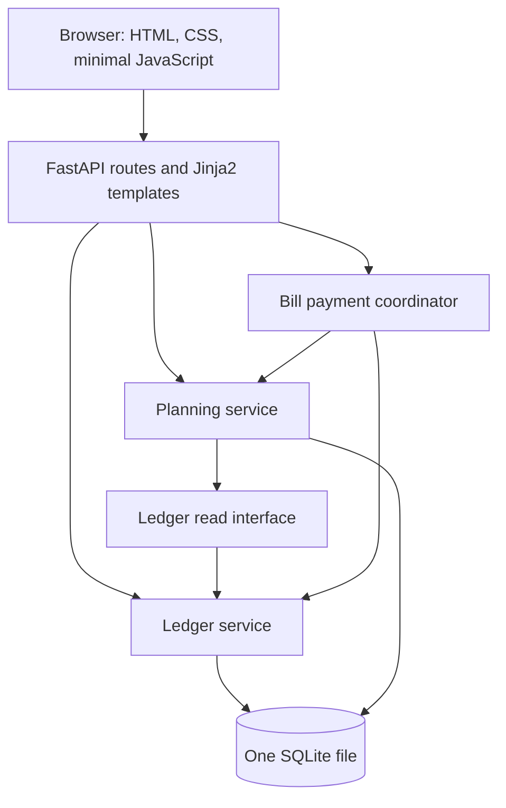
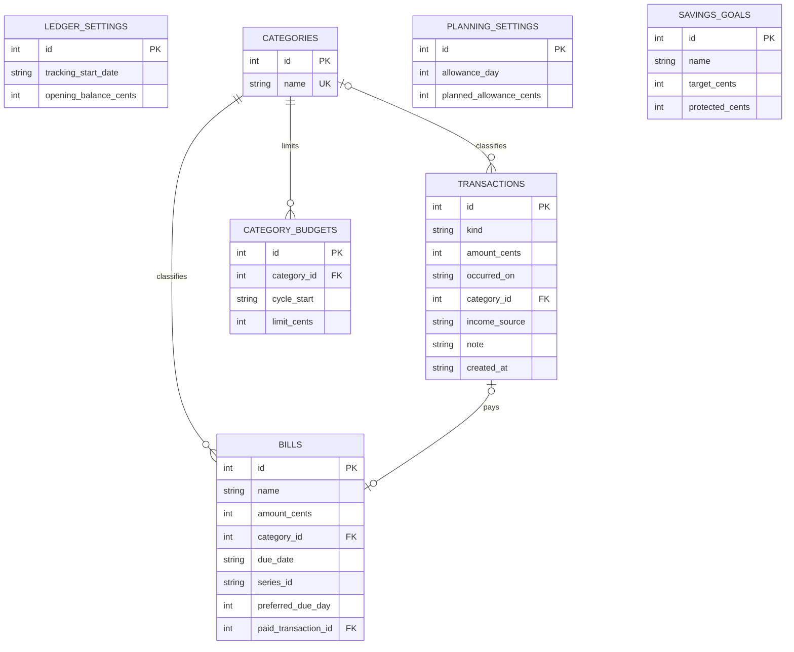

# Float — Software Requirements Specification

Version: 0.1 · Date: 2026-09-28 · Status: proposed implementation baseline, not implemented.

This document translates `PRD.md` into observable behaviour. Requirements are implementation targets; names below are proposed interfaces, not existing code. Schema and testing details must be re-evaluated during implementation and reflected honestly in the later ADR entries and final diagrams.

## 1. System boundary

Python/FastAPI serves HTML templates, static files, and application requests in one process. Python's `sqlite3` accesses one SQLite database. No external runtime APIs or services are required. EUR is the only currency. One person uses the local instance, with no login.

Financial setup occurs through the browser after the server is ready; there is no terminal wizard or manual schema migration. Empty-state pages are valid ready states.

## 2. Terms, dates, and precision

- **Recorded balance:** opening balance + income − expenses recorded since tracking began, through today.
- **Planned allowance:** expected monthly income, default 75,000 cents; it does not change recorded balance.
- **Protected savings:** money earmarked within recorded balance, excluded from discretionary spending.
- **Allowance cycle:** scheduled allowance date inclusive through the next scheduled allowance date exclusive.
- **Today:** the injected clock's calendar date in `APP_TIMEZONE`, default `Europe/Madrid`.

Store money as integer cents. Parse decimal input exactly (for example with `Decimal`); reject more than two fractional digits rather than silently round. Ordinary income, expense, bill, and scenario amounts must be positive. Opening balance may be zero or negative. Limits and protected savings may be zero. All amounts have a maximum magnitude of €1,000,000.00 to bound input. No binary floating-point arithmetic for financial rules.

Dates use ISO `YYYY-MM-DD`. Timestamp metadata uses UTC. Transactions must fall between the tracking start date and today inclusive. Reject future actual transactions; bills may have future or overdue due dates. User-facing date and amount validation must retain submitted values and explain the error.

## 3. Functional requirements

| ID | Requirement and observable behaviour |
|---|---|
| FR-01 | Setup stores tracking start date, opening balance, planned allowance, and allowance day (1–31). Start date cannot be later than today. Opening balance represents cash immediately before the recorded transactions on the start date. Default planned allowance is €750. Setup creates no automatic income. |
| FR-02 | Allowance day and tracking start/opening balance are fixed after setup for this MVP to avoid silently reinterpreting historical records. Planned allowance amount remains editable. The setup screen explains these restrictions before saving. |
| FR-03 | A manual transaction contains positive amount, date, income/expense kind, category for expenses, and optional note. Income source is `allowance` or `other`. View, edit, and delete ordinary transactions; sort by date descending then ID descending. A recorded expense may make the balance negative; warn but do not conceal or reject a real expense. |
| FR-04 | Provide fixed categories: groceries, eating out, transport, housing, utilities, subscriptions, study, leisure, health, travel, and other. Categories cannot be deleted or renamed in the MVP. Each expense has exactly one valid category; income has none. |
| FR-05 | The dashboard shows recorded balance, planned allowance, relevant unpaid bills, protected savings, discretionary funds, days to next allowance, next allowance date, and suggested daily spending. Display a breakdown and a prominent shortfall when applicable. |
| FR-06 | If no `allowance` income has been recorded from the current cycle start through today, display a receipt reminder. Do not infer that money arrived from the calendar or the planned amount. This reminder is informational; recording two real receipts is allowed. |
| FR-07 | Create, list, edit, and delete unpaid bills with a name, positive amount, category, and due date. Display future, currently reserved, overdue, and paid bills distinctly. Only unpaid bills due before the next allowance date are reserved; overdue bills remain reserved. |
| FR-08 | Paying a bill on today creates exactly one expense for its current amount/category and links it to that bill, in one SQLite transaction. Repeating the action has no further financial effect. Undo payment deletes that linked expense and clears the link atomically. Paid bills and their linked expenses are otherwise read-only; undo first to correct them. |
| FR-09 | Copy a bill into the immediately following allowance cycle by moving its due date one calendar month, clamping to the destination month's last date. Preserve its original preferred day for later copies (31 Jan → 28 Feb → 31 Mar). Copies are unpaid and have a stable series identity. A second copy of the same series into the same destination month is rejected. No automatic copy or scheduler runs. |
| FR-10 | Savings goals contain name, positive target, and protected amount between zero and target inclusive. Creating/editing/removing a goal changes planning reservations only. Total protected savings may exceed cash, in which case show a shortfall; do not fabricate a money transfer. There are no actual savings account transfers in this version. |
| FR-11 | Set an optional category limit per allowance cycle; display actual category expenses, remaining limit, and overspending. Zero is a valid limit; no limit is different from zero. Limits only compare spending and do not reserve cash. Include paid bills, exclude income and virtual savings. |
| FR-12 | A purchase/trip preview takes a positive total cost and returns hypothetical discretionary funds and daily allowance. If funds after purchase are negative, display the shortfall; zero is exactly covered. Never create a transaction, consume a goal, or modify persisted amounts from this preview. |
| FR-13 | Settings and records persist across process restarts. Empty lists, no transactions, no bills, and no goals render usable states rather than server errors. |

## 4. Calculation contract

### 4.1 Cycle dates

For configured allowance day `a`, define `scheduled_date(year, month, a)` as day `min(a, last_day_of_month)`. On each request, the current cycle starts on the latest scheduled date less than or equal to today. `next_allowance_date` is the earliest scheduled date strictly after today.

`days_remaining = (next_allowance_date - today).days`. This counts today through the day before the next receipt date and is always at least one. On the scheduled day itself, start the new cycle and use the following month's date; income remains manual. If an allowance is late, display that the calculation still uses the scheduled next date rather than predicting a delayed arrival.

Budget limits are keyed by cycle start date. Missing limits in a new cycle mean no limit; do not silently carry an old limit forward. Existing cash, goals, and unpaid bills persist across cycle boundaries.

### 4.2 Funds and daily allowance

For all actual transactions through today since the tracking start date:

```text
recorded_balance_cents = opening_balance_cents + income_cents - expense_cents
reserved_bills_cents = sum(unpaid bill amounts where due_date < next_allowance_date)
protected_savings_cents = sum(goal protected amounts)
discretionary_cents = recorded_balance_cents - reserved_bills_cents - protected_savings_cents
shortfall_cents = max(0, -discretionary_cents)
daily_cents = max(0, discretionary_cents) // days_remaining
```

The integer division deliberately rounds the displayed positive daily allowance down to cents. Always show negative discretionary funds separately; a zero daily amount must not hide a deficit. Bills due exactly on the next allowance date belong to the next cycle's reservation window. Show them in upcoming bills so the boundary is visible.

Category limits do not enter this formula. Planned future allowance does not enter it. Money reserved for goals is still included in recorded balance and subtracted exactly once.

For purchase cost `cost_cents`, compute `after_cents = discretionary_cents - cost_cents`, `after_daily_cents = max(0, after_cents) // days_remaining`, and `after_shortfall_cents = max(0, -after_cents)`. Copy the live calculation inputs; do not change them.

### 4.3 Worked acceptance fixture

Use **20 September 2026**, allowance day **1**, opening balance **€0 on 1 September**, received allowance **€750**, and recorded expenses **€250**. There is an unpaid **€120** bill due 25 September and **€50** protected savings.

- Next allowance date: 1 October; days remaining: 11.
- Recorded balance: €500; discretionary funds: €330; suggested spending: **€30.00/day**.
- A €110 purchase leaves €220 and **€20.00/day**, without creating any transaction.
- A €350 purchase produces a **€20 shortfall**, with displayed daily spending €0.00.
- Paying the €120 bill changes cash to €380 and reserved bills to €0. Discretionary funds stay **€330**. This proves the bill is not subtracted twice.

All fixture values are synthetic testing data, not claims about the student's actual transactions.

## 5. Proposed architecture and domain interfaces



Proposed modules: `app/ledger/`, `app/planning/`, `app/application/`, `app/web/`, and shared database/configuration support. Avoid separate repositories, separate manifests, or internal HTTP calls.

- Ledger owns money movement validation, storage, `get_balance(as_of)`, and `get_category_totals(start, end_exclusive, as_of)`.
- Planning owns plan validation/storage, date logic, `calculate_daily_allowance(snapshot, commitments, goals, today)`, and `preview_purchase(...)`.
- A Ledger snapshot supplies integer values through a narrow Python interface. Planning business logic never issues SQL against Ledger tables.
- The application coordinator calls both services for bill payment/undo using a shared database transaction. Services accept the active transaction context rather than independently committing.
- The web layer translates input/errors; business rules remain callable without FastAPI.

Future extraction seam: Ledger becomes a service for actual transactions and balances; Planning becomes a service for commitments and forecasts. The shared atomic payment transaction is an acknowledged coupling. A later split would require an idempotent cross-service workflow and failure handling; it is not solved or implemented here.

## 6. Proposed SQLite model

IDs are integer primary keys except stable bill-series identifiers. Use foreign keys with `PRAGMA foreign_keys = ON` on every connection, parameterized SQL, and transactions for related writes. Apply `NOT NULL`, amount/range checks, and uniqueness rules. SQLite runtime files must not be committed.

| Table / owner | Columns and constraints |
|---|---|
| `ledger_settings` / Ledger | `id` singleton=1 PK; `tracking_start_date` date text; `opening_balance_cents` signed integer |
| `categories` / Ledger | `id` PK; `name` unique text; fixed seed data |
| `transactions` / Ledger | `id` PK; `kind` income/expense; `amount_cents` positive; `occurred_on` date text; `category_id` nullable FK; `income_source` nullable allowance/other; `note` text max 500; `created_at` UTC timestamp. Expense requires category and no income source; income requires source and no category. |
| `planning_settings` / Planning | `id` singleton=1 PK; `allowance_day` 1–31; `planned_allowance_cents` positive, default 75000 |
| `bills` / Planning | `id` PK; `name` text 1–100; `amount_cents` positive; `category_id` FK; `due_date` date text; `series_id` text; `preferred_due_day` 1–31; `paid_transaction_id` nullable unique FK to transactions, delete restricted. Unique (`series_id`, `due_date`). |
| `savings_goals` / Planning | `id` PK; `name` text 1–100; `target_cents` positive; `protected_cents` integer, 0 through target |
| `category_budgets` / Planning | `id` PK; `category_id` FK; `cycle_start` date text; `limit_cents` nonnegative; unique (`category_id`, `cycle_start`) |

The service additionally enforces one bill occurrence per series/destination calendar month, even if a due date is edited. A bill's paid state is derived from its linked transaction, not a second boolean. Undo clears that link before deleting the expense inside the same transaction. Shared category identifiers and foreign keys are explicit monolith tradeoffs; calls cross domain interfaces rather than doing cross-domain repository reads.



Diagrams are proposed designs. Update them and ADR-3 to match the actual schema before submission.

## 7. Interface and validation requirements

Use five simple views: dashboard, transactions, bills, savings, and budget/allowance settings. A purchase preview can be a dashboard form rather than a separate page. New-instance setup is a distinct initial state. Category totals can use a table or simple bars; a charting dependency is unnecessary.

Server-rendered HTML is the proposed baseline. Business actions use POST or equivalent mutation methods, never GET. Successful form submissions redirect to avoid accidental resubmission. Bill payment also needs service-level idempotency because browser redirects alone do not prevent duplicates.

Validate all input on the server. Escape user-entered text, use parameterized SQL, keep database details out of error pages, and return an understandable validation/conflict message for invalid or stale actions. Include CSRF protection for browser mutations; a local app can still receive requests induced by another site. The no-login version is intended for a trusted local environment, not public access.

Application settings such as port/path/timezone use environment variables. Financial records and budgeting preferences are user data persisted through browser forms; they do not require source edits or `.env` files.

## 8. Runtime and quality requirements

| ID | Requirement |
|---|---|
| NFR-01 | One process, started by the planned command `python app.py`; bind `0.0.0.0`; read `PORT` with default 8000. Use one Uvicorn worker and no reload subprocess. |
| NFR-02 | SQLite path is `DATA_DIR/float.sqlite3`, with `DATA_DIR` default `./data`. Create the directory/schema and fixed categories idempotently at startup. Preserve existing records across restarts. |
| NFR-03 | Exactly one root dependency manifest, proposed `requirements.txt`. No per-folder manifests. Proposed direct dependencies: FastAPI, Uvicorn, Jinja2, python-multipart, pytest, pytest-cov; finalize any additional test/security dependencies deliberately. |
| NFR-04 | No mandatory network calls, managed database, cache, queue, separate frontend server, authored Dockerfile/Compose/CI/IaC, or public deployment. |
| NFR-05 | Ready within five seconds on the documented development machine with dependencies installed; dashboard response target under 500 ms for a synthetic 1,000-transaction dataset. Record the machine and observed timings; do not claim an unmeasured result. |
| NFR-06 | Environment configuration includes `PORT`, `DATA_DIR`, and `APP_TIMEZONE`; any added security configuration follows the same pattern. Missing `.env` is supported. Invalid configuration fails clearly without destroying data. |
| NFR-07 | Forms have labels, keyboard operation, visible validation, and readable layouts at phone and desktop widths. Warnings use text, not colour alone. |
| NFR-08 | At least 70% measured line coverage across core Ledger, Planning, and application-coordinator logic. Do not exclude difficult business rules merely to raise the percentage. |

## 9. Verification and traceability

Proposed test tooling: pytest + pytest-cov. Pure logic tests inject dates and integer amounts; persistence/integration tests use isolated temporary SQLite files. No tests touch a personal database. No route coverage requirement substitutes for business-rule coverage.

Planned coverage command (valid once these modules exist):

```sh
pytest --cov=app.ledger --cov=app.planning --cov=app.application --cov-report=term-missing --cov-fail-under=70
```

| Test ID | Requirements | Acceptance case |
|---|---|---|
| AT-01 | FR-01–04 | Opening €100 + allowance €750 − grocery expense €25.40 gives €824.60; editing/deleting recomputes accurately and survives restart. |
| AT-02 | FR-03–04 | Reject €0/negative ordinary transactions, >2 decimal places, invalid category, future dates, and dates before tracking began. Allow a valid expense that makes cash negative. |
| AT-03 | FR-05, FR-12 | All worked fixture values in §4.3 match exactly, including €30/day and €20/day after the preview. |
| AT-04 | FR-05 | €10 discretionary over three days gives €3.33/day; negative discretionary displays zero/day plus the exact shortfall. |
| AT-05 | FR-05–06 | At 31 January with allowance day 31, the next date is 28 February in 2027 and 29 February in 2028. No divide-by-zero; payday never posts income. |
| AT-06 | FR-07 | Overdue unpaid bills reserve cash; paid bills do not. A bill exactly on the next allowance date is visible but not yet reserved. |
| AT-07 | FR-08 | Paying a reserved bill reduces balance and reservation equally; repeated payment creates no second expense. Inject a write failure and verify full rollback. Undo restores both domains. |
| AT-08 | FR-08 | Direct edit/delete of a linked bill expense is rejected through every public mutation path. Paid bill edits require undo first. |
| AT-09 | FR-09 | A 31 January monthly bill copies to 28 February, then 31 March; duplicate destination-month copy is rejected. |
| AT-10 | FR-10 | Protecting €50 lowers discretionary funds by €50 without changing balance. Reject protected > target; release/delete restores discretionary funds. |
| AT-11 | FR-11 | €60 spending against a €50 limit reports €10 overspent; a missing limit differs from zero. Neither alters the cash formula. New-cycle limits are absent. |
| AT-12 | FR-12 | Cost equal to discretionary funds leaves zero; greater cost shows deficit. Database contents are unchanged after either preview. |
| AT-13 | FR-13, NFR-01–04 | Fresh clone/install/start reaches usable setup without `.env`, manual migration, external services, or a reload child process. Restart retains both domains. |
| AT-14 | FR-06 | Expected allowance alone does not increase cash. Recording an actual allowance clears the current-cycle reminder; unrelated income does not. |
| AT-15 | §7, NFR-07 | Manual browser check covers invalid forms, stale bill actions, keyboard use, narrow layout, escaped note text, and rejected cross-site mutation. |

NFR-05 timings require a small measured smoke check. NFR-08 requires the real coverage output in the README. Tests and metrics are not yet implemented or measured.

## 10. Submission obligations

- Obtain professor approval before application implementation.
- Maintain exactly five ADR entries: stack, domain boundaries, schema, testing, and a deliberate omission. Entries must span at least three actual commit dates. This SRS proposes details; finalize decisions as evidence becomes available rather than writing fictional later dates.
- Maintain the six-column AI usage log and student-written implementation explanations as code is accepted.
- Reach 12+ meaningful commits on 6+ calendar days with pushes on those days; no day over 40% of final commits. Documentation and merge commits today do not replace later work.
- Submit a 4–5-page report covering SDLC/SMART goals and actual practice, accurate architecture/schema diagrams, and the prescribed AI disclosure summary. Supply a runnable README with actual coverage command/result.
- Prepare to explain the real code without notes: the written check multiplies the project subtotal.
