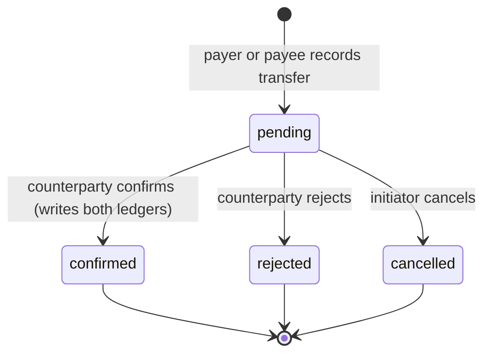
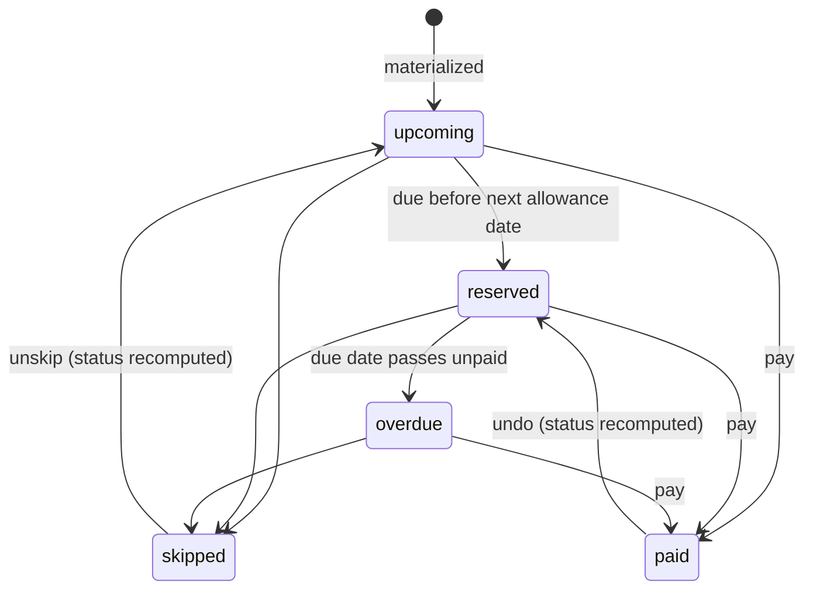
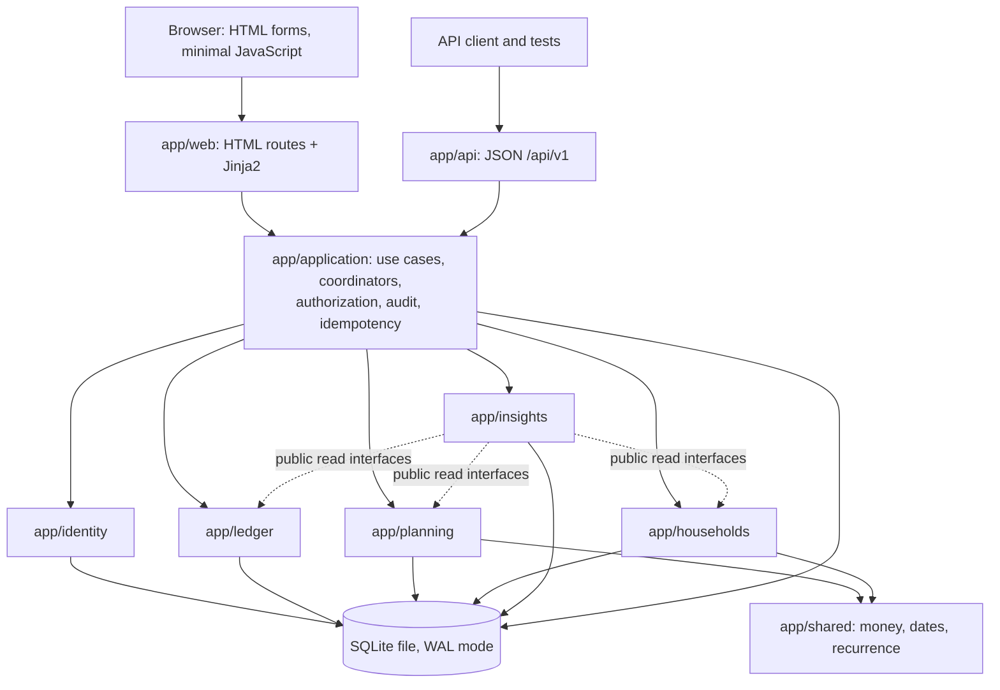
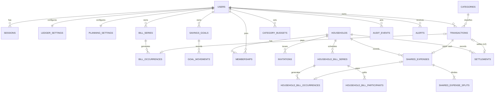

# Float — Software Requirements Specification

Version: 0.2 · Date: 2026-09-30 · Status: approved by the professor (reported by the student on 2026-09-30); implementation in progress per `EXECUTION_PLAN.md`.

This document turns `PRD.md` v0.2 into observable behaviour. Requirements are implementation targets. Names below are proposed interfaces, not existing code. Schema and testing details must be re-evaluated during implementation and reflected honestly in the ADR entries and final diagrams.

Each requirement has a priority (P0/P1/P2, as in PRD §7). A P1/P2 requirement that is not implemented must be reported as not implemented. Formula terms that belong to an unimplemented P1 requirement evaluate to zero.

## 1. System boundary

One Python/FastAPI process serves HTML pages, static files, and a JSON API. Python's `sqlite3` accesses one SQLite database. There are no external runtime APIs or services. EUR is the only currency.

Several users each have their own account on one instance, which is reached over a trusted local network. Float is not hardened for the public internet: TLS termination, email delivery, and public deployment are out of scope (PRD §9).

Account creation and financial setup happen in the browser once the server is ready. There is no terminal wizard or manual migration step. Empty states (no transactions, bills, goals, or households) are valid, usable pages.

## 2. Terms, dates, and precision

- **Recorded balance:** a user's opening balance + income − expenses recorded since their tracking start date, through today.
- **Planned allowance:** a user's expected monthly income, default 75,000 cents. It never changes recorded balance.
- **Allowance cycle:** from a scheduled allowance date (inclusive) to the next scheduled allowance date (exclusive).
- **Horizon:** today up to the allowance date after the next one (exclusive). Recurring occurrences are materialized and forecasts computed within it.
- **Series / occurrence:** a recurrence rule for a bill, and one dated instance generated from it.
- **Obligation / reservation:** money that is committed but has not moved. It reduces discretionary funds, not recorded balance.
- **Net household balance:** for one member of one household, what the member paid for others minus what others paid for them, adjusted by confirmed settlements. Positive means others owe the member.
- **Payable / receivable:** `max(0, −net)` and `max(0, net)` for one member of one household.
- **Consumption:** a user's own spending. It is their personal expenses plus their shares of shared expenses, excluding the cash fronted for others and settlement transfers.
- **Pace:** average daily variable consumption over a recent window (§4.7).
- **Today:** the injected clock's calendar date in `APP_TIMEZONE`, default `Europe/Madrid`.

Store money as integer cents. Parse decimal input exactly (for example with `Decimal`) and reject more than two fractional digits instead of silently rounding. Amounts of transactions, bills, shared expenses, settlements, goals, and previews must be positive. Opening balance may be zero or negative. Limits and goal movements follow their own rules below. Every amount has a maximum magnitude of €1,000,000.00. Financial rules never use binary floating-point arithmetic; percentages are stored as integer basis points (1% = 100).

Dates use ISO `YYYY-MM-DD`. Timestamps use UTC. Actual transactions fall between the owner's tracking start date and today, inclusive; future actual transactions are rejected. Bill occurrences may be future or overdue. A rejected form keeps the submitted values and explains the error.

## 3. Functional requirements

### 3.1 Identity and access

| ID | Pri | Requirement and observable behaviour |
|---|---|---|
| FR-01 | P0 | **Registration.** A username of 3–32 characters from `[a-z0-9_]`, stored lowercase and unique; a display name of 1–50 characters; a password of 10–128 characters. The password is stored only as a salted scrypt hash (§9). Registration signs the user in and leads to setup. |
| FR-02 | P0 | **Sessions.** Login creates a server-side session with a random 256-bit token. Only the token's SHA-256 hash is stored. The cookie is `HttpOnly` and `SameSite=Lax`. A session expires after 48 hours of inactivity or 14 days in total. Login rotates the token. Logout deletes the session. Changing the password deletes all of the user's other sessions. |
| FR-03 | P0 | **Login throttling.** Five failed logins for one username within 15 minutes lock that username for 15 minutes. Twenty failures from one client address within 15 minutes block that address for 15 minutes. Messages never reveal whether a username exists. A successful login clears that username's failure count. |
| FR-04 | P0 | **Authorization.** Personal records (transactions, bills, goals, budgets, alerts) are visible and changeable only by their owner. Household records need active membership. Owner-only actions: invite, revoke invitation, remove member, manage household bills, rename, transfer ownership, archive. A request for another user's record returns 404, so that record existence does not leak. The rule applies identically to HTML and API routes. |

### 3.2 Ledger

| ID | Pri | Requirement and observable behaviour |
|---|---|---|
| FR-05 | P0 | **Setup.** Each user stores a tracking start date (no later than today), an opening balance (cash immediately before the transactions recorded on the start date), a planned allowance (default €750), and an allowance day (1–31). Setup creates no income. Allowance day, tracking start date, and opening balance cannot change after setup, so historical records are never reinterpreted; planned allowance stays editable. Setup explains these restrictions before saving. |
| FR-06 | P0 | **Transactions.** A transaction has a positive amount, a date, a kind (income/expense), an optional note (up to 500 characters), and an `origin`: `manual`, `bill`, `shared`, `settlement`, or `import`. An expense has exactly one category, except settlement transfers, which have none. Income has a source (`allowance`, `settlement`, or `other`) and no category. A manual expense may be flagged `one_off` to exclude it from pace. Lists sort by date descending, then ID descending. An expense that makes cash negative is accepted and shown with a warning. |
| FR-07 | P0 | **Linked transactions.** Only `manual` and `import` transactions can be edited or deleted directly. The others are created, changed, and removed only by the workflow that owns them (bill payment, shared expense, settlement), and every direct-mutation route rejects them. |
| FR-08 | P0 | **Categories.** A fixed set: groceries, eating out, transport, housing, utilities, subscriptions, study, leisure, health, travel, and other. Categories cannot be renamed or deleted. |

### 3.3 Planning

| ID | Pri | Requirement and observable behaviour |
|---|---|---|
| FR-09 | P0 | **Bill series.** A personal bill series has a name (1–100 characters), a positive amount, a category, and a rule (§4.2): `once`; `weekly` every 1–52 weeks; or `monthly` every 1–12 months. Its anchor date is the first occurrence and cannot be earlier than the owner's tracking start date. It ends by an optional inclusive `until` date or an optional total occurrence count of 1–500, never both. |
| FR-10 | P0 | **Materialization.** Before any read or write that depends on bills, the occurrences of every active series within the horizon are generated idempotently (§4.2). Repeating materialization, whether concurrent or after a restart, never creates duplicates. No background scheduler runs. |
| FR-11 | P0 | **Occurrence status.** Each occurrence is shown as `upcoming`, `reserved` (unpaid and due before the next allowance date), `overdue` (unpaid and due before today; still reserved), `paid`, or `skipped`. Paid status comes from the linked transaction, not a separate flag. Skipped occurrences reserve nothing and can be unskipped while unpaid. |
| FR-12 | P0 | **Pay and undo.** Paying an occurrence creates exactly one `bill` expense for its current amount and category, dated today or a user-chosen earlier date within tracking, and links it to the occurrence in one transaction. Repeating the action has no further effect. Undo deletes the linked expense and clears the link atomically. A paid occurrence is read-only until its payment is undone. |
| FR-13 | P0 | **Edits.** *This occurrence only* changes an unpaid occurrence's amount or due date. *This and future* splits the series at an occurrence (§4.2): it is rejected if any occurrence on or after the split point is paid, and paid history is never altered. *End series* stops future generation and deletes unpaid, unskipped occurrences due today or later. Overdue occurrences remain until they are paid or skipped. |
| FR-14 | P0 | **Savings goals.** A goal has a name, a positive target, and a protected amount equal to the sum of its dated protect (+) and release (−) movements. A movement is rejected if the protected amount would fall below zero or exceed the target. Movements never change recorded balance and never create transactions. Protected savings may exceed cash; that shows a shortfall rather than an invented transfer. |
| FR-15 | P1 | **Goal plan.** A goal may have a target date, a priority (1 high, 2 normal, 3 low), and `auto_reserve`. With a target date, the current cycle's planned contribution and pending reserve follow §4.6. Goals are shown as `complete`, `on plan`, `behind`, or `overdue` (target date passed before the target was reached). Overdue goals reserve nothing and raise an alert. |
| FR-16 | P1 | **Budgets.** A category limit can be set for one cycle (override) or as a template for every cycle. The effective limit is the override if present, otherwise the template, otherwise none. No limit is different from a zero limit. Limits compare against consumption (§4.7) and never reserve cash. |

### 3.4 Households

| ID | Pri | Requirement and observable behaviour |
|---|---|---|
| FR-17 | P0 | **Households.** A user who has completed setup can create a household (name 1–60 characters) and becomes its owner. A household has 2–8 active members once others join; a user belongs to at most 3 active households. The owner can rename the household or transfer ownership to another active member. A household can be archived only when every net balance is zero and no settlement is pending. It then becomes read-only history. |
| FR-18 | P0 | **Invitations.** The owner creates an invitation code: 10 characters from the Crockford base32 alphabet, generated with `secrets`. It is shown once, stored only as a SHA-256 hash, expires after 72 hours, works once, and can be revoked. Joining requires login, completed setup, a free membership slot, and an active, unexpired, unused code. Invalid, expired, used, and revoked codes all give the same message. |
| FR-19 | P0 | **Leaving and removal.** A member can leave, or the owner can remove them, only when their net balance is zero, no pending settlement involves them, and they are not a participant in any active household bill series. Otherwise the action is rejected with the blocking reasons listed. The owner cannot leave while other members remain; they must transfer ownership first. Former members keep read access to history from their membership period. |
| FR-20 | P0 | **Shared expenses.** An active member records an expense **they paid**: amount, date, category, description (1–100 characters), optional `one_off` flag, participants (a subset of active members, which may exclude the payer), and a split (FR-21). In one transaction the application layer creates the shared expense, its splits, and the payer's linked personal `shared` expense for the full amount. The date must fall within the payer's tracking period and no later than today. |
| FR-21 | P0 | **Split methods.** `equal`; `exact` (non-negative cents per participant summing exactly to the amount); `percentage` (basis points per participant summing exactly to 10,000); `shares` (integer weights 1–100). The allocation in §4.3 guarantees the shares sum to the amount. At least one participant must have a positive share. The stored splits record the method inputs and the resulting cents. |
| FR-22 | P0 | **Edit and delete.** Only the payer can edit or delete a shared expense. Each edit presents the row `version` it was based on; a stale version returns a conflict showing the latest values (§6.4). The linked personal expense changes or is deleted in the same transaction. Expenses generated by a household bill payment are changed only through that payment's undo (FR-26). |
| FR-23 | P0 | **Balances and settle-up plan.** The household page shows each member's net balance (§4.4), the itemised expenses and settlements behind it, and a simplified transfer plan (§4.4). Net balances always sum to zero. Each member's payable in each household feeds their safe-to-spend. |
| FR-24 | P0 | **Settlements.** Either party records a transfer made outside Float: payer, payee, a positive amount, and `paid_on` (no later than today and within both users' tracking periods). It starts `pending` and does not affect balances. Only the counterparty (the member who did not record it) can confirm or reject it, with an optional reason of up to 200 characters. Only the initiator can cancel it while pending. Confirmation atomically sets the status, creates the payer's `settlement` expense and the payee's `settlement` income (both dated `paid_on`), and updates both balances. Repeated confirmation has no further effect, and terminal states are immutable (§5). An amount above the suggested transfer is allowed with a warning. |
| FR-25 | P0 | **Household bills.** The owner defines recurring household bill series with the same rules as FR-09, plus participants and a split template of `equal`, `percentage`, or `shares` (`exact` is not allowed because the actual amount may vary). The anchor date cannot be earlier than the day the series is created; a cost that is already overdue is recorded as a shared expense instead. Occurrences are materialized like personal ones. Any participant can edit an unpaid occurrence's amount (for example when the real invoice arrives) or skip it. Each participant's template share of an unpaid, unskipped occurrence due before their next allowance date is reserved in their safe-to-spend. |
| FR-26 | P0 | **Paying household bills.** Any participant can pay an unpaid occurrence. In one transaction the application layer creates a shared expense (payer = that member, splits from the template at the occurrence's current amount), the payer's linked personal expense, and the link from the occurrence. Other participants' reservations become payables with no change to their safe-to-spend (§4.5). Only the payer can undo the payment; undo removes all three atomically and requires a current version. |

### 3.5 Insights and safe-to-spend

| ID | Pri | Requirement and observable behaviour |
|---|---|---|
| FR-27 | P0 | **Dashboard.** Shows recorded balance, each formula term of §4.5, discretionary funds, days to the next allowance, the next allowance date, and safe-to-spend per day. Every term links to the records behind it. A shortfall is shown prominently and a zero daily amount never hides a deficit. |
| FR-28 | P0 | **Allowance reminder.** If no `allowance` income has been recorded from the current cycle start through today, a reminder is shown. The calendar or planned amount never implies that money arrived. Recording two real receipts in one cycle is allowed. |
| FR-29 | P0 | **Purchase/trip preview.** A positive total cost returns hypothetical discretionary funds, the daily amount, and any shortfall (§4.5). It never writes to the database. |
| FR-30 | P1 | **Forecast and pace.** Shows pace, runway, run-out date, status (`on_track`/`at_risk`), projected carry-over, a day-by-day cash projection with and without expected allowance, its lowest point, and the next-cycle outlook (§4.7). Shows "not enough history" when the pace window is under 7 days. |
| FR-31 | P1 | **Consumption insight and anomalies.** Current-cycle consumption by category against effective limits (`ok`, `warning` at ≥ 80%, `over` above 100%; a zero limit is `over` for any positive consumption). Expenses are flagged as unusual by §4.8. |
| FR-32 | P1 | **Alerts.** Evaluated when the dashboard or alert centre loads and after each successful write, per §4.9. Types: `BILL_DUE_SOON`, `BILL_OVERDUE`, `BUDGET_WARNING`, `BUDGET_OVER`, `PACE_AT_RISK`, `UNUSUAL_EXPENSE`, `SETTLEMENT_AWAITING_YOU`, `HOUSEHOLD_EXPENSE_ADDED`, `ALLOWANCE_NOT_RECORDED`, and `GOAL_OVERDUE`. Alerts are deduplicated per user by key, can be marked read or dismissed, and resolve automatically when their condition clears. |
| FR-33 | P1 | **Audit trail.** Every financial or membership mutation appends an audit event in the same database transaction: actor, entity, action, before/after JSON, request ID, and UTC time. Audit events are never updated or deleted. The household activity feed shows events for a household to its members; a user sees their own personal events. |

### 3.6 API and integration

| ID | Pri | Requirement and observable behaviour |
|---|---|---|
| FR-34 | P1 | **JSON API.** `/api/v1` exposes the same use cases as the HTML routes (§8.2), with the same services, authorization, and validation. It is documented by FastAPI's generated OpenAPI schema. Errors use `application/problem+json` (RFC 9457) with field-level details. Money is serialized as integer cents plus a formatted string. |
| FR-35 | P1 | **Idempotency keys.** A money-creating API `POST` may send an `Idempotency-Key` header (1–64 visible ASCII characters). The first successful response is stored per user and key with a hash of the request, and replayed for 24 hours. The same key with a different request returns `409`. Server-side checks (FR-12, FR-24, FR-26) still prevent duplicates without the header. |

### 3.7 Stretch capabilities and persistence

| ID | Pri | Requirement and observable behaviour |
|---|---|---|
| FR-36 | P2 | **CSV statement import.** Upload up to 1 MB and 2,000 rows. The delimiter (`,` or `;`) and decimal separator (`.` or `,`, as Spanish banks use) are detected, and the user maps the date, amount, and description columns. A preview labels each row `new`, `duplicate` (same fingerprint as an existing transaction), `possible_duplicate` (same amount within ±2 days of an existing transaction), or `invalid`, with the reason. Commit imports the selected rows atomically as `import` transactions in one batch. Re-uploading a file with the same SHA-256 warns. A batch can be undone within 7 days if none of its rows was edited. |
| FR-37 | P2 | **Category suggestions.** Users define rules (a case-insensitive "description contains" text → category, ordered by priority). Otherwise the suggestion is the most frequent category among the user's last 50 expenses sharing the description's first normalized word, with at least 3 matches and ties going to the most recent. Suggestions prefill forms and imports and are never applied without the user's confirmation. |
| FR-38 | P2 | **Cycle review.** After a cycle ends, a review shows consumption against limits, the change in protected savings, pace against safe-to-spend, and a suggested sweep. The suggested sweep splits the user's currently unreserved discretionary funds across goals in priority order, then earliest target date, filling each goal's next planned contribution first. Accepting it creates goal movements; nothing is applied automatically. |
| FR-39 | P0 | **Persistence and empty states.** Accounts, settings, and all records persist across restarts. Empty lists and a household with a single member render usable pages rather than errors. |

## 4. Calculation contract

All functions in this section are pure. They take injected dates and integer cents, do no I/O, and are unit-tested without FastAPI or SQLite.

### 4.1 Cycle dates

For allowance day `a`, `scheduled_date(year, month, a)` is day `min(a, last_day_of_month)`. The current cycle starts on the latest scheduled date on or before today. `next_allowance_date` is the earliest scheduled date strictly after today, and `horizon_end` is the scheduled date after that.

`days_remaining = (next_allowance_date - today).days`. It counts today through the day before the next allowance date and is always at least 1. On the scheduled day itself the new cycle has started; income remains manual. If an allowance is late, the dashboard says the calculation still uses the scheduled date.

Budget overrides are keyed by cycle start date. A missing override falls back to the template (FR-16) and never to an older cycle's override. Cash, goals, unpaid occurrences, and household balances persist across cycle boundaries.

### 4.2 Recurrence expansion and materialization

A rule has `freq` (`once`/`weekly`/`monthly`), `interval`, `anchor_date`, and at most one of `until` (inclusive) or `count`. The k-th candidate (k = 0, 1, 2, …) is:

```text
once:    k = 0 only → anchor_date
weekly:  anchor_date + 7 · interval · k days
monthly: month m = anchor_month + interval · k (year carried);
         date = (year, m, min(anchor_day, last_day_of(year, m)))
```

The anchor day is kept for every later month, so month-end clamping never drifts (31 Jan → 28 Feb → 31 Mar). A candidate is valid when `k < count` (if set) and `date <= until` (if set). `expand(rule, window_start, window_end_exclusive)` returns the valid candidates inside the window in ascending order. Because candidates are counted from the anchor, a count-limited rule gives the same dates whatever window is requested.

Materialization runs lazily inside the request's write transaction. For each active series it expands `[materialized_through + 1 day, horizon_end)`, inserts occurrences with `INSERT … ON CONFLICT (series_id, scheduled_date) DO NOTHING`, and advances `materialized_through`. Each occurrence keeps its immutable `scheduled_date` (the uniqueness key) separately from its editable `due_date`, so moving a due date can never let the rule regenerate the original date as a duplicate.

**This and future** at occurrence `o` with scheduled date `s`:

1. Reject the split if any occurrence of the series with `scheduled_date >= s` is paid.
2. Set the old series' `until = s − 1 day`. If the old series had a `count`, convert it to that `until` date.
3. Delete the old series' occurrences with `scheduled_date >= s`.
4. Create a new series with the edited values, anchored at `s` unless the user chose another anchor. If the old series had a `count`, the new one keeps the remaining occurrence count.
5. Materialize the new series.

All five steps run in one transaction and are recorded in the audit trail. Household bill series follow the same rules.

### 4.3 Split allocation

`allocate(amount_cents, participants)` takes participants ordered by ascending user ID with integer weights, and returns integer shares:

```text
equal:      weight 1 each
percentage: weight = basis points; weights must sum to 10000
shares:     weight = the given integer 1–100
W = sum(weights)
base_i      = amount_cents * weight_i // W
remainder   = amount_cents - sum(base_i)                  # 0 ≤ remainder < number of participants
rank by (amount_cents * weight_i) % W descending, then user ID ascending
first `remainder` participants in that ranking receive +1 cent
exact:      shares are the given cents; they must already sum to amount_cents
```

This is the largest-remainder method using integer comparisons only. Invariants, which are tested with property-based tests: shares sum exactly to the amount; every share is within 1 cent of its exact proportional value; the same inputs always give the same output.

### 4.4 Household balances and simplification

For member `u` of household `h`, counting only confirmed settlements:

```text
net(u) = Σ amount of shared expenses paid by u
       − Σ u's shares of all shared expenses
       + Σ confirmed settlements u paid
       − Σ confirmed settlements u received
```

`Σ net(u)` over the household is always 0. Pending, rejected, and cancelled settlements have no effect.

`simplify(nets)` produces the settle-up plan. It repeatedly matches the member with the largest positive net against the member with the most negative net (ties broken by ascending user ID) and records a transfer of `min(credit, |debt|)` from debtor to creditor. It stops when all nets are zero. The plan has at most `n − 1` transfers for `n` members with non-zero nets, and each transfer settles at least one member completely. Greedy matching does not always give the smallest possible number of transfers, which is NP-hard in general. Float accepts this because the result is predictable and explainable.

### 4.5 Safe-to-spend

For user `u` on `today`:

```text
recorded_balance      = opening_balance + Σ income − Σ expenses        (tracking start … today)
personal_bills        = Σ amount of u's unpaid, unskipped occurrences with due_date < next_allowance_date
household_bill_shares = Σ u's template share of unpaid, unskipped household occurrences
                        (u a participant) with due_date < next_allowance_date
protected_savings     = Σ protected amount of u's goals
household_payables    = Σ over u's households of max(0, −net(u))
goal_plan_reserve     = Σ pending_reserve(g) over u's auto-reserve goals             (§4.6, P1)

discretionary = recorded_balance − personal_bills − household_bill_shares
              − protected_savings − household_payables − goal_plan_reserve
shortfall     = max(0, −discretionary)
daily         = max(0, discretionary) // days_remaining
```

Integer division rounds the daily amount down to whole cents. A negative discretionary amount is always shown as a shortfall. Occurrences due exactly on the next allowance date belong to the next cycle: they are listed as upcoming, not reserved. Receivables and planned allowance never appear in the formula (PRD §5). Protected money stays inside recorded balance and is subtracted exactly once.

**Conservation invariant.** Define a user's position as `recorded_balance − personal_bills − household_bill_shares − protected_savings − goal_plan_reserve + Σ net`, so that `discretionary = position − Σ receivables`. Four conversions leave every affected user's position unchanged:

- paying a personal occurrence;
- paying a household occurrence;
- confirming a settlement;
- protecting money up to a goal's pending reserve.

Each of them therefore changes `discretionary` by exactly minus the change in that user's receivables. In the common cases receivables do not change, so `discretionary` stays the same: paying your own bill, protecting planned goal money, settling no more than you owe, and a flatmate paying a household bill when you are not owed money. In the other cases the payer of a household bill loses exactly the receivable they gain, and a settlement's payee gains exactly the receivable that is paid off. Tests assert this identity for every conversion.

**Preview.** For cost `c`: `after = discretionary − c`, `after_daily = max(0, after) // days_remaining`, and `after_shortfall = max(0, −after)`. The preview works on a copy of the live inputs and never writes.

### 4.6 Goal contribution plan (P1)

For goal `g` with a target date and `auto_reserve`, in the cycle starting `cycle_start`:

```text
cycles_left           = |{ scheduled allowance dates s : cycle_start ≤ s < target_date }|
protected_at_start    = Σ movements dated before cycle_start
remaining_at_start    = max(0, target − protected_at_start)
planned               = ceil(remaining_at_start / cycles_left)               (fixed for the whole cycle)
protected_this_cycle  = Σ movements dated from cycle_start through today   (may be negative)
pending_reserve       = min(planned, max(0, planned − protected_this_cycle),
                            max(0, target − protected_now))
```

If `cycles_left = 0` (target date on or before the current cycle start) and the target has not been reached, the goal is `overdue`: its `pending_reserve` is 0 and `GOAL_OVERDUE` is raised. A goal is `complete` when protected equals its target, `on plan` when `pending_reserve = 0`, and `behind` otherwise. Releasing money re-reserves whatever part of this cycle's plan it undoes. Only the rest of the release raises safe-to-spend, because `pending_reserve` stays between 0 and `planned`.

### 4.7 Consumption, pace, and forecast (P1)

```text
consumption(u, [start, end)) = Σ u's expenses with origin manual, bill, or import in the range
                             + Σ u's shares of shared expenses dated in the range
variable_consumption         = consumption excluding bill-origin expenses, shares of expenses generated
                               by household bills, and anything flagged one_off
window_days                  = min(28, (today − tracking_start).days)       (complete days before today)
pace                         = variable_consumption(u, [today − window_days, today)) // window_days
```

If `window_days < 7`, pace is unavailable and the forecast shows "not enough history". `effective_pace` is `pace` when available, otherwise `daily`.

```text
runway_days    = 0 if discretionary < 0; unlimited if effective_pace = 0;
                 otherwise discretionary // effective_pace
run_out_date   = today + runway_days
status         = on_track if runway_days ≥ days_remaining else at_risk
carry_over     = max(0, discretionary − effective_pace · days_remaining)
```

**Cash projection.** For each date `d` from today to `horizon_end − 1`:

```text
committed_by(d) = Σ unpaid, unskipped personal occurrences with due_date ≤ d (overdue ones count from today)
                + Σ u's shares of unpaid, unskipped household occurrences with due_date ≤ d
                + household_payables                                      (assumed settled today)
conservative(d) = recorded_balance − committed_by(d) − effective_pace · ((d − today).days + 1)
expected(d)     = conservative(d) + planned_allowance · |{ scheduled allowance dates s : today < s ≤ d }|
```

The lowest point is the minimum of `expected(d)`, taking the earliest date on a tie. Warnings: a lowest point below `protected_savings` ("the plan dips into savings") and any `conservative(d) < 0` ("depends on the allowance arriving").

**Next-cycle outlook.** For the cycle `[next_allowance_date, horizon_end)`:

```text
next_commitments = Σ personal occurrences and u's household shares due in that cycle (unpaid, unskipped)
                 + Σ next-cycle planned contribution of auto-reserve goals
                   (remaining_next = max(0, target − protected_now − pending_reserve);
                    ceil(remaining_next / (cycles_left − 1)), or 0 when cycles_left ≤ 1)
next_free        = carry_over + planned_allowance − next_commitments
next_daily       = max(0, next_free) // (horizon_end − next_allowance_date).days
next_shortfall   = max(0, −next_free)
```

The outlook is labelled as an estimate that assumes the planned allowance arrives on time.

### 4.8 Unusual expenses (P1)

Take a `manual` or `import` expense `e` in category `k`, and let `X` be the user's other expenses in `k` dated within the 90 days before `e`. If `|X| < 8`, nothing is flagged. Otherwise, with the lower median `med(S) = sorted(S)[(|S| − 1) // 2]`, which keeps everything in integer cents:

```text
m         = med(X)
mad       = med({ |x − m| : x ∈ X })
threshold = m + 3 · max(mad, 100)
unusual   = e.amount > threshold
```

The 100-cent floor stops identical histories from flagging tiny increases. The reason is shown in plain language ("€14.00 is well above your typical €10.00 for eating out").

### 4.9 Alert rules (P1)

| Type | Condition (evaluated for the viewing user) | Dedupe key | Resolves when |
|---|---|---|---|
| `BILL_DUE_SOON` | Unpaid, unskipped occurrence (personal, or household where participant) with today ≤ due ≤ today + 3 | `BILL_DUE_SOON:{kind}:{occurrence_id}` | Paid, skipped, or overdue |
| `BILL_OVERDUE` | Same, with due < today | `BILL_OVERDUE:{kind}:{occurrence_id}` | Paid or skipped |
| `BUDGET_WARNING` / `BUDGET_OVER` | Category state per FR-31 in the current cycle | `BUDGET_{state}:{category_id}:{cycle_start}` | State changes |
| `PACE_AT_RISK` | Status `at_risk` (§4.7) | `PACE_AT_RISK:{cycle_start}` | Status `on_track` |
| `UNUSUAL_EXPENSE` | §4.8 flags an expense dated in the last 7 days | `UNUSUAL_EXPENSE:{transaction_id}` | Expense edited below threshold or deleted |
| `SETTLEMENT_AWAITING_YOU` | Pending settlement where the user is the counterparty | `SETTLEMENT:{settlement_id}` | No longer pending |
| `HOUSEHOLD_EXPENSE_ADDED` | Audit event newer than the user's alert cursor: another member created or changed a shared expense where the user has a positive share | `HOUSEHOLD_EXPENSE:{audit_event_id}` | Never (dismiss only) |
| `ALLOWANCE_NOT_RECORDED` | FR-28 condition | `ALLOWANCE:{cycle_start}` | Allowance recorded |
| `GOAL_OVERDUE` | §4.6 overdue state | `GOAL_OVERDUE:{goal_id}` | Target reached or date changed |

Evaluation upserts by `(user_id, dedupe_key)`. It sets `resolved_at` when a condition clears and clears it if the condition returns. Dismissal is permanent for that key. Evaluation is idempotent: running it twice without data changes produces no new rows.

### 4.10 Worked acceptance fixtures

All fixture values are synthetic test data, not claims about anyone's real finances.

**Fixture A — shared flat (P0 formula, P1 forecast).** Today is Sunday **20 September 2026**. Ana (user 1), Ben (2), and Carla (3) each have allowance day 1, tracking since 1 September, and a €0 opening balance. They share the household "Flat 3B".

- Ana received her €750 allowance on 1 September. She recorded €220 of manual expenses (€188 everyday plus a €32 concert ticket flagged `one_off`). On 19 September she paid €30 of groceries split equally between all three (€10 each), creating a €30 `shared` expense in her ledger.
- Ben paid €90 of electricity on 18 September, split equally (€30 each).
- Ana has a monthly personal bill "Phone + gym" of €120, anchored 25 September and unpaid. Her goal "Emergency fund" has €50 protected (a movement on 2 September). The household has a monthly "Internet" bill of €36, anchored 28 September, equal split, unpaid.

Expected results:

- Nets: Ana −€10, Ben +€50, Carla −€40 (sum 0). The settle-up plan is Carla → Ben €40 and Ana → Ben €10.
- Ana: recorded balance €500; personal bills €120; household bill shares €12; protected €50; payables €10; goal reserve €0; **discretionary €308**. Next allowance is 1 October, 11 days remain, so **€28.00/day**.
- Preview €110 → €198 and **€18.00/day**. Preview €350 → **€42.00 shortfall** and €0.00/day. The database is unchanged.

Conservation sequence, applied in order:

1. Ana pays "Phone + gym": cash €380, personal bills €0, discretionary **€308**.
2. Ana records a €10 settlement to Ben: pending, nothing changes. Ben confirms: Ana's cash is €370 and her payable €0, so discretionary stays **€308**. Ben's net becomes +€40.
3. Carla pays "Internet" (€36): Ana's €12 share moves from reservation to payable, discretionary **€308**. Carla's discretionary is also unchanged, because fronting €24 for others cuts her payable from €40 to €16.
4. Ana records a €60 dinner she paid, split equally (€20 each): her net becomes +€28, her payable €0, and discretionary falls to **€260**. That is €20 of her own consumption plus €28 she is owed, which counts only once settled.

Forecast for Ana in the base state (before step 1):

- Pace window 19 days, variable consumption €188 + €10 + €30 = €228, so **pace €12.00/day**.
- Runway 25 days, run-out 15 October, status `on_track`, carry-over **€176**.
- Cash projection: expected lowest point **€226.00 on 30 September**. Conservative projection on 31 October is −€278, so the plan depends on the allowance arriving.
- Next-cycle outlook for October (31 days): commitments €120 + €12 = €132, next_free = €176 + €750 − €132 = €794, so **€25.61/day**.

**Fixture B — goal plan (P1).** Today is 20 September 2026, allowance day 1. Goal "Laptop": target €600, target date 1 March 2027, `auto_reserve` on, €0 protected before 1 September, +€50 protected on 2 September.

- Cycles left: Sep, Oct, Nov, Dec, Jan, Feb = 6. Planned contribution €100, pending reserve **€50**.
- Protecting another €50 today leaves discretionary unchanged. A further €30 lowers it by €30.
- With €130 protected when October starts, October's plan is ceil(€470 / 5) = **€94**.

**Fixture C — pace at risk (P1).** Discretionary €100.00, 10 days remaining, pace €15.00/day. Daily €10.00; runway 6 days; `at_risk`; carry-over €0; `PACE_AT_RISK` raised once, however many times alerts are evaluated.

**Fixture D — splits.**

| Case | Result |
|---|---|
| €100.00 equal among users 1, 2, 3 | €33.34 / €33.33 / €33.33 |
| €10.00 at 33.33% / 33.33% / 33.34% | €3.33 / €3.33 / €3.34 |
| €10.01 shares 2 : 1 : 1 | €5.01 / €2.50 / €2.50 |
| €100.00 exact €40 / €35 / €25 | accepted |
| €100.00 exact €40 / €35 / €24.99 | rejected: sums to €99.99 |
| €100.00 at 50% / 49.99% | rejected: 9,999 basis points |

**Fixture E — recurrence.**

- Monthly, anchored 31 January 2027: 31 Jan, 28 Feb, 31 Mar, 30 Apr 2027. The same rule anchored 31 January 2028 gives 29 February 2028.
- Weekly, every 2 weeks, anchored Friday 4 September 2026: 4 Sep, 18 Sep, 2 Oct, 16 Oct.
- Monthly, every 3 months, anchored 15 October 2026: 15 Oct 2026, 15 Jan 2027, 15 Apr 2027.
- Monthly with count 3, anchored 5 November 2026, expanded over [1 Dec 2026, 1 Dec 2027): 5 Dec 2026 and 5 Jan 2027 only.
- Series split (user tracking since 1 July 2026, today 20 September 2026): gym €40 monthly, anchored 5 July. July and August are paid; the 5 September occurrence is unpaid and overdue. *This and future* at 5 October with €45 ends the old series on 4 October and keeps 5 September at €40 (still reserved). The new series starts on 5 October at €45. The same edit at 5 August is rejected because that occurrence is paid.

**Fixture F — unusual expense.** Eating-out history (8 items): €8, €9, €10, €10, €11, €12, €13, €15. Median €10.00, MAD €1.00, threshold €13.00. A new €14.00 expense is flagged; €13.00 is not.

**Fixture G — simplification.** Nets +€60, −€10, −€20, −€30 for users 1–4. The plan is 4 → 1 €30, 3 → 1 €20, 2 → 1 €10: three transfers, which is n − 1.

## 5. State machines





Occurrence status is derived on read from the due date, the skip timestamp, and the payment link, so the diagram describes derived states rather than a stored enum. Settlement status is stored. Each transition is an `UPDATE … WHERE id = ? AND status = 'pending'` whose affected row count is checked inside the transaction, so a repeated or concurrent request cannot apply a transition twice.

Invitations are `active` until used, revoked, or expired (derived from `expires_at`). Alerts are open, then `read`, `dismissed`, or `resolved`, as §4.9 describes.

## 6. Proposed architecture

### 6.1 Modules and dependency rule



Each domain package has `rules.py` (pure logic), `repository.py` (parameterized SQL on its own tables only), `service.py` (validation and commands), and `api.py` (the only module other packages may import). The dependency rule: web/api → application → domains. Domains never import each other. Insights imports only the domains' `api.py`. An automated architecture test parses imports and fails the build on violations.

`app/shared` is a shared kernel of pure functions: money parsing and formatting, cycle dates, and recurrence expansion (§4.1–4.2). It has no database access.

### 6.2 Public domain interfaces (proposed)

| Module | Interface | Returns |
|---|---|---|
| Identity | `register`, `authenticate`, `resolve_session(token_hash, now)`, `change_password` | `CurrentUser`, session tokens |
| Ledger | `get_balance(user_id, as_of)`, `get_expense_rows(user_id, start, end)`, `create_linked(...)`, `update_linked(...)`, `delete_linked(...)` | integer cents, typed rows, transaction IDs |
| Planning | `get_cycle(user_id, today)`, `ensure_materialized(user_id, today)`, `get_obligations(user_id, today)`, `link_payment(...)`, `unlink_payment(...)` | `Cycle`, `PlanningObligations` |
| Households | `ensure_materialized(household_id, today)`, `get_position(user_id, window_end)`, `get_share_rows(user_id, start, end)`, `nets(household_id)` | `HouseholdPosition`, typed rows |
| Insights | `safe_to_spend(inputs, cycle)`, `preview(...)`, `forecast(...)`, `evaluate_alerts(user_id, today)` | `SafeToSpend`, `Forecast` |

Every interface receives the active connection or unit of work and returns immutable dataclasses of integers, dates, and strings, never database rows.

### 6.3 Coordinated workflows

| Workflow | Writes | Idempotency / guard |
|---|---|---|
| Pay personal occurrence (FR-12) | Ledger `bill` expense; Planning link | `UPDATE … SET paid_transaction_id = ? WHERE id = ? AND paid_transaction_id IS NULL AND skipped_at IS NULL`; 0 rows → roll back, report "already paid" |
| Undo personal payment (FR-12) | Planning unlink; Ledger delete | Checks the link still points to the expected transaction |
| Record / edit / delete shared expense (FR-20–22) | Households expense + splits; Ledger `shared` expense | Row `version`; the payer check happens inside the transaction |
| Pay / undo household occurrence (FR-26) | Households shared expense + splits + link; Ledger payer expense | Link guard as above; undo checks `version` |
| Confirm settlement (FR-24) | Households status; Ledger payer expense and payee income | `UPDATE … WHERE status = 'pending' AND version = ?`; 0 rows → no ledger writes |
| Every workflow above | Audit events (FR-33); alerts re-evaluated after commit | Audit events live in the same transaction; alert evaluation is idempotent |

### 6.4 Transactions, concurrency, and determinism

- Every connection sets `PRAGMA foreign_keys = ON` and `PRAGMA busy_timeout = 5000`. The database uses `journal_mode = WAL`, so readers do not block the single writer.
- Each write use case runs in one unit of work opened with `BEGIN IMMEDIATE`, which takes the write lock up front and avoids lock-upgrade deadlocks. Services never commit; the unit of work commits or rolls back.
- All mutable rows carry an integer `version`. Updates use `WHERE id = ? AND version = ?`. Zero affected rows means a conflict: the HTML form shows the latest values, and the API returns `409`. Once the audit trail (FR-33) exists, the message also names who last changed the record.
- Tests inject a failure after the first write of each coordinated workflow and assert that nothing persisted.
- The clock, the token generator, and the request ID are injected, so tests are deterministic.

### 6.5 Future extraction seam

If Ledger, Planning, and Households became separate services, the coordinated workflows would become sagas with a transactional outbox and idempotent consumers. Cross-domain foreign keys would become IDs validated through events. This version intentionally keeps one database transaction instead. That coupling is recorded in the domain-boundary ADR and is not implemented as distributed infrastructure.

## 7. Proposed SQLite model

IDs are integer primary keys. SQL is always parameterized. Constraints are declared in the schema (`NOT NULL`, `CHECK`, `UNIQUE`, foreign keys) and re-validated in services with user-friendly messages. Numbered migration files are applied idempotently at startup and recorded in `schema_migrations`. SQLite runtime files are never committed.

| Owner | Table | Key columns and constraints |
|---|---|---|
| Identity | `users` | `username` unique, lowercase; `display_name`; `password_hash` (scrypt parameters, salt, and hash); `created_at`; `password_changed_at` |
| Identity | `sessions` | `user_id` FK (cascade); `token_hash` unique; `csrf_token`; `created_at`; `last_seen_at`; `expires_at` |
| Identity | `login_attempts` | `username_key`; `client_address`; `attempted_at`; `succeeded`; indexed by key+time and address+time; rows older than 24 hours pruned |
| Ledger | `ledger_settings` | `user_id` PK/FK; `tracking_start_date`; `opening_balance_cents` (signed) |
| Ledger | `categories` | `name` unique; fixed seed data |
| Ledger | `transactions` | `user_id` FK; `kind`; `amount_cents > 0`; `occurred_on`; `category_id` nullable FK; `income_source` nullable; `origin`; `one_off`; `note` ≤ 500; `import_batch_id` nullable FK; `fingerprint` nullable; `version`; timestamps. CHECK: income ⇒ source set, no category; expense ⇒ no source, category set unless `origin = 'settlement'`. Index (`user_id`, `occurred_on`) |
| Ledger (P2) | `import_batches`, `import_rows` | batch: `user_id`, `file_sha256`, `status` (`preview`/`committed`/`undone`); rows: parsed values, `fingerprint`, `status`, `reason`, `transaction_id` |
| Planning | `planning_settings` | `user_id` PK/FK; `allowance_day` 1–31; `planned_allowance_cents > 0` (default 75000) |
| Planning | `bill_series` | `user_id`; `name`; `amount_cents`; `category_id`; `freq`; `interval`; `anchor_date`; `until_date` / `max_count` (CHECK not both); `materialized_through`; `ended_at`; `version` |
| Planning | `bill_occurrences` | `series_id` FK; `user_id`; `scheduled_date`; `due_date`; `amount_cents`; `skipped_at`; `paid_transaction_id` unique nullable FK (restrict); `version`; UNIQUE (`series_id`, `scheduled_date`) |
| Planning | `savings_goals` | `user_id`; `name`; `target_cents > 0`; `target_date` nullable; `priority` 1–3; `auto_reserve`; `archived_at`; `version` |
| Planning | `goal_movements` | `goal_id` FK; `delta_cents <> 0`; `moved_on`; `note`; append-only (mistakes are reversed by an opposite movement) |
| Planning | `budget_templates` / `category_budgets` | PK (`user_id`, `category_id`) / UNIQUE (`user_id`, `category_id`, `cycle_start`); `limit_cents >= 0` |
| Households | `households` | `name`; `owner_user_id` FK; `created_at`; `archived_at`; `version` |
| Households | `memberships` | `household_id`; `user_id`; `role` (`owner`/`member`); `status` (`active`/`left`/`removed`); `joined_at`; `ended_at`; partial UNIQUE (`household_id`, `user_id`) WHERE `status = 'active'` |
| Households | `invitations` | `household_id`; `code_hash` unique; `created_by`; `expires_at`; `used_by`/`used_at`; `revoked_at` |
| Households | `shared_expenses` | `household_id`; `payer_user_id`; `amount_cents`; `category_id`; `description`; `spent_on`; `split_method`; `one_off`; `payer_transaction_id` unique FK (restrict); `version` |
| Households | `shared_expense_splits` | PK (`expense_id`, `user_id`); `weight` nullable; `share_cents >= 0`; expense FK cascade |
| Households | `household_bill_series` / `household_bill_participants` | series as `bill_series` plus `household_id` and `split_method` (`equal`/`percentage`/`shares`); participants PK (`series_id`, `user_id`) with `weight` |
| Households | `household_bill_occurrences` | as `bill_occurrences`, but `shared_expense_id` unique nullable FK (restrict) marks payment |
| Households | `settlements` | `household_id`; `payer_user_id` ≠ `payee_user_id`; `initiated_by`; `amount_cents`; `paid_on`; `status`; `reason`; `payer_transaction_id`/`payee_transaction_id` unique nullable; `version`. CHECK: `status = 'confirmed'` ⇔ both transaction IDs set |
| Application | `audit_events` | `actor_user_id`; `household_id` nullable; `entity_type`; `entity_id`; `action`; `before_json`; `after_json`; `request_id`; `occurred_at`. `BEFORE UPDATE` and `BEFORE DELETE` triggers abort, making the table append-only |
| Application | `idempotency_keys` | PK (`user_id`, `key`); `request_hash`; `status_code`; `response_json`; `created_at`; expired rows pruned |
| Insights | `alerts` / `alert_cursors` | UNIQUE (`user_id`, `dedupe_key`); `type`; `severity`; `message`; `subject_url`; `read_at`/`dismissed_at`/`resolved_at` / cursor: `user_id` PK, `last_audit_event_id` |

A payment link column (`paid_transaction_id`, `shared_expense_id`, the settlement transaction IDs) is the only record of paid status, so there is never a second boolean to drift out of sync. Undo clears the link before deleting the linked rows, in the same transaction. Foreign keys from Planning and Households into `transactions` and `users` are an explicit monolith tradeoff (§6.5). Code still crosses domain boundaries only through `api.py` interfaces.



The diagrams are proposed designs. Update them and the schema ADR to match the real schema before submission.

## 8. Interface requirements

### 8.1 HTML views

Login/registration, setup, dashboard (breakdown, pace, preview form), transactions, bills (series and occurrences), goals, budgets, alerts, forecast, household list, and a household page with tabs for balances and settle-up, expenses, bills, settlements, members and invitations, and activity. CSV import is a P2 view. Charts are inline SVG or simple bars; a charting dependency is unnecessary.

Mutations use POST (or PUT/PATCH/DELETE through the API), never GET. Successful form submissions redirect. Forms carry the row `version` they were rendered with, and stale submissions show the conflict message from §6.4.

### 8.2 JSON API (`/api/v1`, P1)

| Resource | Endpoints |
|---|---|
| Auth | `POST /auth/register`, `POST /auth/login`, `POST /auth/logout`, `GET /me`, `POST /me/password` |
| Setup | `POST /setup`, `GET /settings`, `PATCH /settings` (planned allowance only) |
| Transactions | `GET/POST /transactions`, `GET/PATCH/DELETE /transactions/{id}` |
| Bills | `GET/POST /bills`, `POST /bills/{id}/end`, `GET /occurrences?from&to`, `PATCH /occurrences/{id}`, `POST /occurrences/{id}/pay`, `/undo`, `/skip`, `/unskip`, `/split` |
| Goals and budgets | `GET/POST /goals`, `PATCH /goals/{id}`, `POST /goals/{id}/movements`, `GET/PUT /budgets/templates`, `PUT /budgets/{cycle_start}/{category_id}` |
| Households | `GET/POST /households`, `GET/PATCH /households/{id}`, `POST /households/join`, `POST /households/{id}/invitations`, `DELETE /invitations/{id}`, `POST /households/{id}/leave`, `DELETE /households/{id}/members/{user_id}`, `POST /households/{id}/transfer`, `POST /households/{id}/archive` |
| Shared money | `GET/POST /households/{id}/expenses`, `PATCH/DELETE /households/{id}/expenses/{eid}`, `GET /households/{id}/balances`, `GET/POST /households/{id}/settlements`, `POST /settlements/{sid}/confirm`, `/reject`, `/cancel`, `GET/POST /households/{id}/bills`, `POST /household-occurrences/{oid}/pay`, `/undo`, `/skip` |
| Insights | `GET /dashboard`, `GET /dashboard/preview?cost=`, `GET /forecast`, `GET /insights/categories?cycle=`, `GET /alerts`, `POST /alerts/{id}/read`, `/dismiss`, `GET /activity`, `GET /households/{id}/activity` |
| Import (P2) | `POST /imports`, `GET /imports/{id}`, `POST /imports/{id}/commit`, `POST /imports/{id}/undo` |

Lists are paginated with `limit` (default 50, maximum 100) and an opaque cursor. Money-creating `POST`s accept `Idempotency-Key` (FR-35).

## 9. Security requirements

- **Passwords:** `hashlib.scrypt` with n = 2^14, r = 8, p = 1, a 16-byte random salt, and a 32-byte key, stored as `scrypt$n$r$p$salt$hash`. Comparison uses `hmac.compare_digest`. When the username does not exist, a dummy hash is still computed so response timing does not reveal it.
- **Sessions:** as FR-02. The `Secure` cookie flag is set by `COOKIE_SECURE`, which defaults to false because the trusted-LAN deployment has no TLS. This limitation is documented, not hidden.
- **CSRF:** a per-session synchronizer token, sent in a hidden form field or the `X-CSRF-Token` header and compared in constant time. Unsafe methods also check `Origin`/`Referer` against the host. No state changes happen on GET.
- **Authorization:** central `require_owner`/`require_member` checks in the application layer. Repository queries also always filter by user or membership, as defence in depth. Foreign records return 404 (FR-04).
- **Output and input:** Jinja2 autoescaping everywhere, and user text is never marked safe. Server-side validation for every field. Form bodies are limited to 64 KB and imports to 1 MB.
- **Headers:** `Content-Security-Policy: default-src 'self'`, `frame-ancestors 'none'`, `X-Content-Type-Options: nosniff`, `Referrer-Policy: same-origin`.
- **Errors and logs:** clients never see stack traces or SQL. Error pages show a request ID. Logs never contain passwords, session tokens, CSRF tokens, or invitation codes.
- **Out of scope:** TLS, two-factor authentication, and password reset (PRD §9). Float must therefore only run on a trusted network.

## 10. Runtime and quality requirements

| ID | Requirement |
|---|---|
| NFR-01 | One process started by `python app.py`; binds `0.0.0.0`; reads `PORT` (default 8000); one Uvicorn worker and no reload subprocess. |
| NFR-02 | The database is `DATA_DIR/float.sqlite3` (`DATA_DIR` defaults to `./data`). Startup creates the directory, enables WAL, applies migrations, and seeds categories idempotently. Existing records survive restarts. |
| NFR-03 | Exactly one root dependency manifest, `requirements.txt`, and no per-folder manifests. Proposed direct dependencies: FastAPI, Uvicorn, Jinja2, python-multipart, pytest, pytest-cov, hypothesis, and httpx2 (the HTTP transport used by Starlette's test client). Password hashing uses the standard library. |
| NFR-04 | No mandatory network calls, managed database, cache, queue, background worker, separate frontend server, authored Dockerfile/Compose/CI/IaC, or public deployment. |
| NFR-05 | Ready within 5 seconds on the documented development machine. Dashboard response, including materialization and alert evaluation, under 500 ms at p95 for a synthetic dataset: a 3-member household, 5,000 personal transactions per member, 1,000 shared expenses, and 20 bill series. Record the machine and measured timings; never claim an unmeasured result. |
| NFR-06 | Environment configuration: `PORT`, `DATA_DIR`, `APP_TIMEZONE`, `COOKIE_SECURE`, `SESSION_IDLE_HOURS` (48), `SESSION_MAX_DAYS` (14). A missing `.env` is fine. Invalid configuration fails clearly without touching data. |
| NFR-07 | Forms have labels, keyboard operation, and visible validation, and layouts are readable at phone and desktop widths. Warnings use text, not colour alone. |
| NFR-08 | At least 70% measured line coverage across `app.identity`, `app.ledger`, `app.planning`, `app.households`, `app.insights`, `app.application`, and `app.shared`. Difficult business rules are not excluded just to raise the percentage. |
| NFR-09 | After the integration suite, `PRAGMA integrity_check` and `PRAGMA foreign_key_check` report no problems. The README documents backup as copying the database with SQLite's online backup API or while the app is stopped. |
| NFR-10 | Every request gets a request ID, which appears in logs, error pages, and audit events. One structured log line per request records method, route template, status, duration, and user ID, and no secrets. |

## 11. Verification and traceability

Proposed tooling: pytest, pytest-cov, hypothesis (property-based tests), and FastAPI's test client. Test levels:

- **Unit:** the pure rules of §4 with injected dates and integer cents, including every fixture in §4.10.
- **Property-based:** allocation invariants (§4.3); nets summing to zero and plans settling everyone within n − 1 transfers (§4.4); recurrence output sorted, unique, in-window, and consistent across windows (§4.2); conservation over random sequences of conversions (§4.5).
- **Integration:** services and coordinated workflows on isolated temporary SQLite files, with fault injection for rollback. No test touches a personal database.
- **Concurrency:** two connections racing on the same settlement or occurrence. Exactly one transition succeeds and the other sees a conflict or no-op.
- **HTTP:** an authorization matrix over HTML and API routes, CSRF rejection, and API parity with the HTML use cases.
- **Manual:** browser checks that automation does not cover (AT-30).

Coverage command (valid once these modules exist):

```sh
pytest --cov=app.identity --cov=app.ledger --cov=app.planning --cov=app.households --cov=app.insights --cov=app.application --cov=app.shared --cov-report=term-missing --cov-fail-under=70
```

| Test ID | Requirements | Acceptance case |
|---|---|---|
| AT-01 | FR-01–02 | Registration validation and case-insensitive uniqueness; login, logout; idle and absolute session expiry with an injected clock; password change ends other sessions. |
| AT-02 | FR-03 | Five failures lock the username for 15 minutes, even against the correct password; access returns after the lock; unknown and known usernames get identical messages. |
| AT-03 | FR-04, §9 | Authorization matrix: another user's transaction, bill, goal, alert, or non-member household returns 404 on every read and mutation route; a non-owner member gets 403 for owner-only actions. |
| AT-04 | FR-05–08 | Opening €100 + allowance €750 − groceries €25.40 = €824.60; edits and deletes recompute; values survive a restart. |
| AT-05 | FR-06–07 | Reject €0/negative amounts, more than two decimals, invalid categories, future dates, and dates before tracking. Accept an expense that makes cash negative. Linked transactions reject direct edit/delete on HTML and API routes. |
| AT-06 | §4.1 | Allowance day 31: next date 28 Feb 2027 and 29 Feb 2028; `days_remaining ≥ 1`; payday never posts income. |
| AT-07 | FR-09–10, §4.2 | Fixture E expansions; recurrence properties; repeated and concurrent materialization create no duplicates. |
| AT-08 | FR-11–12 | Overdue occurrences are reserved; one due exactly on the next allowance date is not. Pay creates exactly one expense; repeating it has no effect; an injected failure rolls everything back; undo restores both domains. |
| AT-09 | FR-13 | The Fixture E split, including rejection when a later occurrence is paid; moving a due date does not regenerate the original date; ending a series keeps overdue occurrences. |
| AT-10 | FR-14 | Protecting €50 lowers discretionary by €50 without changing balance; movements that would push protected below 0 or above target are rejected. |
| AT-11 | FR-15, §4.6 | All Fixture B values, including the overdue state and alert. |
| AT-12 | FR-16, FR-31 | €60 consumption against a €50 limit is €10 over; a template applies to a new cycle; an override beats the template; no limit differs from zero; a €30 shared grocery bill paid by the user counts as €10 of their consumption. |
| AT-13 | FR-17–19 | Household limits; single-use invitation codes; expired, revoked, and used codes share one message; leaving is blocked by a non-zero balance, a pending settlement, or bill participation, and the reasons are listed; the owner must transfer ownership before leaving. |
| AT-14 | FR-20–21, §4.3 | Fixture D; allocation properties; the payer's personal expense equals the full amount and is linked. |
| AT-15 | FR-22 | Only the payer can edit or delete; a stale version gives a conflict showing the latest values; the linked ledger expense changes atomically. |
| AT-16 | FR-23, §4.4 | Fixture A nets and plan; Fixture G; net and plan properties. |
| AT-17 | FR-24, §5 | Only the counterparty confirms or rejects, and only the initiator cancels; repeated confirmation writes one pair of ledger entries; terminal states are immutable; a concurrent confirm and cancel have exactly one winner. |
| AT-18 | FR-25–26 | Household bill shares are reserved per participant; paying converts them to payables; undo restores everything; an `exact` template is rejected. |
| AT-19 | FR-27, FR-29, §4.5 | Fixture A base values and both previews; the database is byte-for-byte unchanged after a preview. |
| AT-20 | §4.5 | Fixture A conservation steps 1–4 match exactly; the conservation property holds. |
| AT-21 | FR-28 | Expected allowance alone never increases cash; recording an actual allowance clears the reminder and unrelated income does not. |
| AT-22 | FR-30, §4.7 | Fixture A forecast values (pace, runway, carry-over, lowest point, next-cycle outlook), Fixture C, and "not enough history" under 7 days. |
| AT-23 | FR-31, §4.8 | Fixture F; fewer than 8 samples flag nothing. |
| AT-24 | FR-32, §4.9 | Evaluating twice creates no duplicates; paying a bill resolves its alert; dismissal persists when the condition returns; household expense alerts reach participants but not the actor. |
| AT-25 | FR-33 | Each mutation writes an audit event that rolls back with a failed transaction; `UPDATE`/`DELETE` on `audit_events` aborts. |
| AT-26 | FR-34–35 | The API dashboard matches Fixture A; errors are problem+json; an idempotent replay returns the same body; the same key with a different body returns 409; no duplicate settlement is possible. |
| AT-27 | §6.1 | The architecture test finds no domain-to-domain imports, and Insights imports only `api.py` modules. |
| AT-28 | FR-36–38 (P2) | A `;`-delimited CSV with decimal commas parses; duplicate classes are correct; commit is atomic and undo removes the batch; suggestions follow FR-37; the sweep follows FR-38. |
| AT-29 | FR-39, NFR-01–04, NFR-09 | Fresh clone, install, and start reach registration without `.env`, manual migration, external services, or a reload child; a restart retains all domains; integrity checks are clean. |
| AT-30 | §8–9, NFR-07 | Manual browser check: cross-site POST rejected, note text escaped, security headers present, keyboard use and narrow layout work, and the stale-edit conflict message is shown. |
| AT-31 | NFR-05 | A performance smoke test on the synthetic dataset with the machine and timings recorded. |

NFR-05 requires a measured smoke check, and NFR-08 requires the real coverage output in the README. Tests and metrics are not yet implemented or measured.

## 12. Submission obligations

- Professor approval of this v0.2 scope was reported by the student on 30 September 2026, before any application code was written.
- Maintain exactly five ADR entries: stack, domain boundaries, schema, testing, and a deliberate omission. Entries must span at least three actual commit dates. This SRS proposes details; finalize decisions as evidence becomes available rather than writing fictional later dates.
- Maintain the six-column AI usage log and student-written implementation explanations as code is accepted.
- Reach 12+ meaningful commits on 6+ calendar days, with pushes on those days, and no day above 40% of final commits. Documentation and merge commits do not replace later work.
- Submit a 4–5-page report covering SDLC/SMART goals and actual practice, accurate architecture and schema diagrams, and the prescribed AI disclosure summary. Supply a runnable README with the actual coverage command and result.
- Prepare to explain the real code without notes: the written check multiplies the project subtotal.
