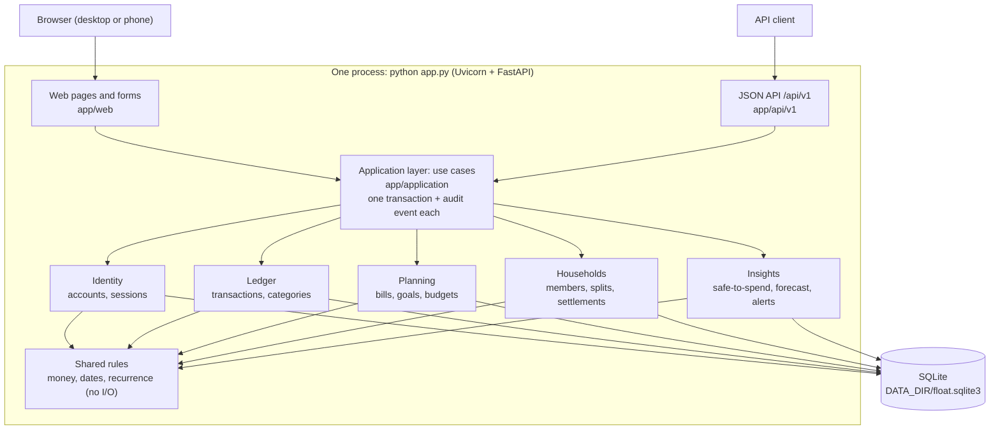
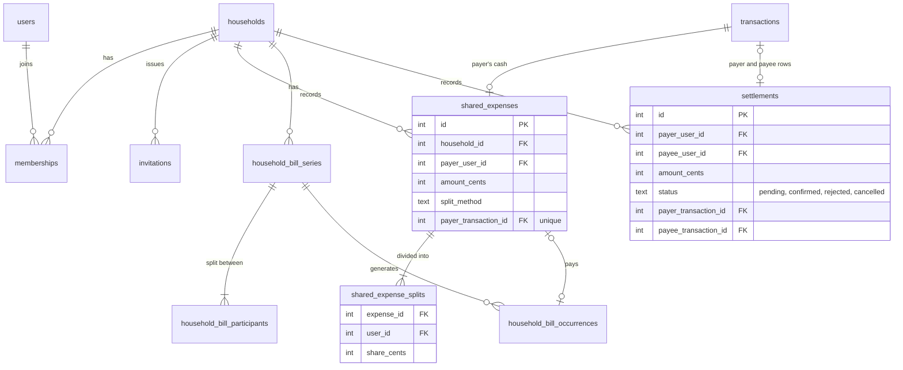

# Float: Project Report

**Individual Assignment 1: a simple application as the basis for DevOps work**
Sanad AlBilleh · 4 October 2026 · Repository: https://github.com/Sanad-AlBilleh/Float

## 1. The problem and the product

Students who live on a monthly allowance and share a flat can't easily answer a simple question: *how much can I safely spend today?* Not all of the money in their account is theirs to spend. Part of it is already promised to bills, part to their share of the rent, part to what they owe flatmates, and part to savings. A banking app only shows the balance, and a splitting app like Splitwise only shows debts. Nothing puts them together.

Float puts them together. I record my income and expenses by hand (it never connects to a bank), and the dashboard shows:

> safe to spend per day = (recorded balance − bills due before my next allowance − my share of household bills − protected savings − what I owe flatmates − planned goal savings) ÷ days until the next allowance

Every term on the dashboard links to the records behind it. Around that number Float has recurring bills, savings goals with a monthly plan, budgets, unusual expense flags, a spending forecast, households with exact cost splitting and a settle-up plan, alerts, an activity feed and a JSON API.

My first version of the idea (28 September) was a single-user allowance tracker. The professor said the idea and the backend were too simple, so on 30 September I expanded it to version 0.2 with households, recurring bills, goal plans, forecasting, alerts and multiple users. The professor approved the new scope that day, before I wrote any application code.

**Stakeholders.** The main users are students on a fixed allowance sharing a flat of 2 to 8 people. Parents who send the allowance benefit indirectly, because their child runs out of money less often. For sizing I assumed a flat runs Float on one machine on the home network, with up to about 16,000 transactions after several years. The speed test uses exactly that amount.

## 2. SDLC model and SMART goals

**The model I chose: incremental and test-first, one vertical slice per day.** Each day delivered one working, tested part of the app (database, logic, pages and tests together), merged into `main` through a pull request. I chose this over waterfall because the professor's feedback on 30 September had just changed my scope, so I needed a process that could absorb changes. I chose it over full Scrum because I worked alone for one week, so sprints, stand-ups and a backlog tool would have been ceremony with no benefit. Writing the tests first fitted a money app: the SRS has worked examples with exact cent values, and each one became a test before the code existed.

The plan, fixed in `planned-commits.md` on 30 September, was:
- **28 Sep:** the idea and requirements v0.1.
- **30 Sep:** requirements v0.2 and the foundation (settings, database, migrations, money and date rules).
- **1 Oct:** accounts, security and the personal ledger.
- **2 Oct:** bills, goals, safe-to-spend, the forecast and budgets.
- **3 Oct:** households, settlements, alerts and the JSON API (the first thing to cut if I ran late).
- **4 Oct:** testing, fixes and UI polish only.

**SMART goals** (from PRD §10, all due by 4 October 2026):
- **G1:** A new user registers, finishes setup and records an expense in under 2 minutes. *Result:* covered by automated page tests. By hand it took me __ seconds.
- **G2:** Two flatmates record a shared expense, see matching balances and complete a confirmed settlement in under 3 minutes. *Result:* covered by automated tests. By hand it took me __ seconds.
- **G3:** Every domain keeps its data in SQLite across restarts. *Result:* met. Checked on the real server on 2, 3 and 4 October.
- **G4:** Every worked example in the SRS passes, splits always add up to the exact amount, household balances always sum to zero, and coverage of the business modules is at least 70%. *Result:* met, with Fixtures A to G passing, Hypothesis properties passing and 97% coverage.
- **G5:** No dashboard number counts the same money twice. *Result:* met. A property test checks this over random sequences of actions.
- **G6:** No user can read or change another user's private records. *Result:* met. Authorization tests cover every page that shows records and every API route group.
- **G7:** Clone, install and one start command give a ready app. *Result:* met. A fresh clone installed, started and passed every test on 4 October.

**How I followed it in practice.** The plan mostly held, and every change was written down in `planned-commits.md` on the day it happened:
- On 30 September I moved all the 4 October features to 2 and 3 October, so the last day could be for testing.
- The JSON API was first in line to be cut, but I had time on 3 October, so I built it.
- There were three unplanned fix commits: on 1 October the request log never printed and a review found 11 small issues, and on 3 October checkboxes were stretched.
- 4 October went beyond fixes. After looking at the app I asked for a redesign based on reference screenshots, custom categories, automatic categories, a savings question in setup and a demo data script. This broke my own "no new features" rule for the last day, and I recorded that.
- I didn't push anything on 29 September, so every day after that had to carry real work to reach 6 days.

The final history has 61 commits across 6 days: 3 on 28 Sep, 9 on 30 Sep, 11 on 1 Oct, 8 on 2 Oct, 9 on 3 Oct and 21 on 4 Oct. The biggest day is 34% of the total, under the 40% limit.

## 3. Architecture

Float is a **modular monolith**: one Python process running FastAPI, with Jinja2 pages and SQLite, started with `python app.py` (ADR 1). It binds to `0.0.0.0`, reads `PORT` and `DATA_DIR` from the environment, and creates and migrates its database on start, so it meets the deployment contract without changes.



**The two main domains and where the seam is (ADR 2).** The two required domains are the **personal Ledger and Planning** side (my own money, bills and goals) and the **Households** side (shared expenses and settlements). Identity and Insights are smaller extra modules. Each domain is a package with `rules.py` (pure functions), `repository.py` (SQL on its own tables only), `service.py` and `api.py`. Other code may only import `api.py`, and `tests/test_architecture.py` reads every import and fails if one domain imports another. The one allowed exception is Insights, which may read other domains through their `api.py` because it only calculates. The web and API layers also import a few things straight from a domain's `api.py` (types like `Session` and `SplitEntry`, form validators and read-only lookups like the category list), but every change to money or membership goes through the application layer.

Some actions touch more than one domain. Paying a household bill creates a shared expense (Households) and the payer's expense (Ledger). Confirming a settlement writes into two people's ledgers. Those live in `app/application/`, which runs each one inside a single SQLite `BEGIN IMMEDIATE` transaction with an audit event, so it either fully happens or not at all. That layer is the seam: if Households became its own service, these coordinators would become API calls with an outbox.

**No background jobs (ADR 5).** Recurring bills are created lazily when a page needs them, and repeating that is harmless (`INSERT ... ON CONFLICT DO NOTHING`). Alerts are recalculated when the dashboard opens and after every change. This keeps Float to one process.

## 4. Database schema

All data is in one SQLite file at `DATA_DIR/float.sqlite3`, built by 12 numbered migrations (`app/db/migrations/0001` to `0012`). The rules from ADR 3: money is always `INTEGER` cents, every table is `STRICT` with `CHECK` limits, a bill is paid exactly when `paid_transaction_id` points at the expense that paid it (so there is no status flag that can disagree), occurrences are unique on `(series_id, scheduled_date)`, goal movements can't be updated and audit events can't be updated or deleted (triggers block it), and editable rows have a `version` column for safe concurrent edits.

**Personal side (Identity, Ledger, Planning, Insights):**


**Shared side (Households), linked to the Ledger through transactions:**



Six small support tables are not drawn: `sessions` and `login_attempts` (Identity), `audit_events` (the change log that can never be edited), `alert_cursors`, `idempotency_keys` (the API's retry protection) and `schema_migrations`. The full columns are in the migration files.

**How the two domains' data relates.** Households never copy money into a separate balance. A shared expense points at the payer's real ledger row through `payer_transaction_id`, and a confirmed settlement points at one row in each person's ledger. So the Ledger stays the single record of cash, and Households only stores who owes whom.

## 5. Two algorithms I'm proud of

**Exact splits (`allocate` in `app/households/rules.py`).** Each person first gets `amount × weight // total_weight`, which rounds down. The leftover cents go one each to the people with the biggest remainders, and a tie goes to the lower user ID. Worked by hand: €100.00 split equally between three people is 10,000 cents. Each person gets 10,000 × 1 // 3 = 3,333, so 9,999 cents are handed out and 1 cent is left. All three remainders are equal, so the lowest user ID gets it: €33.34, €33.33 and €33.33. The total is exactly €100.00, and a Hypothesis test checks that for thousands of random amounts and weights.

**Settle-up (`simplify`).** Each member's net is what they paid minus their shares, and the nets always sum to zero. `simplify` repeatedly takes the person owed the most and the person who owes the most, and makes the smaller of the two amounts a transfer. Example: Borja +€40, Lucía −€10, Marco −€30. Marco pays Borja €30 (Marco is now 0, Borja +€10), then Lucía pays Borja €10. That's two transfers for three people. It never needs more than n − 1 transfers, although it is not always the absolute minimum.

**Safe-to-spend never double-counts.** When I pay a bill, the money moves from "reserved for bills" to "spent", so the daily number stays the same. A property test runs random sequences of bill payments, household bill payments, settlements and savings, and checks this every time.

## 6. Testing

My testing approach is ADR 4. In short: pure functions for every calculation, unit-tested against the SRS worked examples; Hypothesis property tests for the rules that must always hold; tests against a real temporary SQLite file instead of mocks (including fault injection and two connections racing on the same settlement); HTTP tests for pages and the API (authorization, CSRF); and, after each feature, injecting small bugs to check the tests catch them.

**Coverage command** (also in the README):

```
pytest --cov=app.identity --cov=app.ledger --cov=app.planning --cov=app.households --cov=app.insights --cov=app.application --cov=app.shared --cov-report=term-missing
```

**Results on 4 October:**
- 604 tests passed.
- 97% coverage of the business modules (2,925 statements, 83 missed), and 95% for the whole app.
- Mutation checks on 2 and 3 October injected 121 small bugs. 38 survived the first run: 29 were real gaps that got new tests, and 9 could not change behaviour.
- The dashboard took 48 ms (p95) with 16,000 transactions, against a 500 ms limit, and the app was ready 62 ms after starting.
- Three review passes by a helper agent found 11 issues (1 October), 9 issues (3 October) and 5 more on the evening of 4 October (the worst: Edit and Delete links on a paid household bill that led to an error page). All 25 were fixed with tests written first.

The mutation checks taught me the most. Full line coverage had hidden boundary bugs, like a bill due exactly on payday, which only showed up when a test failed to notice a `<` changed to `<=`.

## 7. Reflection

Working in daily slices meant `main` always had a version that ran. That mattered when the professor asked for a bigger scope: I could change the plan without throwing away working code. The hardest part was the household money rules. Making sure a household bill, a settlement and a personal bill each move money between "reserved", "owed" and "spent" without changing safe-to-spend took longer than any page. The redesign was also harder than it looked, because our Content Security Policy blocks inline styles, so every progress bar had to become an SVG.

If I did it again, I would push something on 29 September so I had a spare day, plan the UI earlier instead of leaving it to the end, and keep the last day for fixes only, as I first planned.

**What I checked myself.** I used the running app myself and gave my own UI feedback on 4 October (card padding, setup layout, form fields, budget boxes, custom categories). I also had the review agents rerun their main reproductions on the real server instead of trusting the tests alone.

## 8. AI disclosure

I acknowledge the use of OpenAI Codex and Anthropic's Claude Code (Claude Opus 5.5) to choose and scope the idea, write the requirements, plan the build, write the application code and tests, review the app for bugs, redesign the interface, and draft the documentation, including this report. The prompts used include "give me 5 ideas i could do", "the professor said the idea is a bit weak and needs to be a bit more complex", "start executing the 30 sep build and commit push and merge it", "run a opus 5.5 medium effort helper to review the entire app" and "look at the screenshots, i want the app to look something similar to this UI". The output of these prompts was used to produce the PRD, SRS and execution plan, the Float code and its tests, the bug fixes, the ADR and README drafts, and this report. I directed the work and reviewed it at each step. The full prompt-by-prompt log, with my own explanation of how each part works, is in `AI_USAGE.md`.

## 9. Conclusion

Float meets its goals: both domains store everything in SQLite, the money rules are exact to the cent, the tests cover 97% of the business logic, and a fresh clone runs with one command. I'm proudest of the safe-to-spend number, because it combines personal and shared money without ever counting the same euro twice. One thing to fix before a real deployment: login throttling counts failures per client address, and behind a cloud proxy every user may share one address, so I would read the real client address from the proxy header. Next I would add CSV import from bank exports and "this and future" edits for household bills, and in Assignment 2 I would split Households into its own service, using the application layer as the seam.
