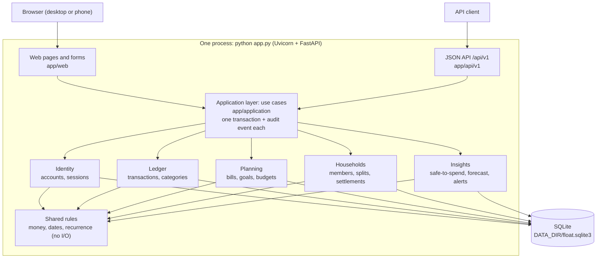
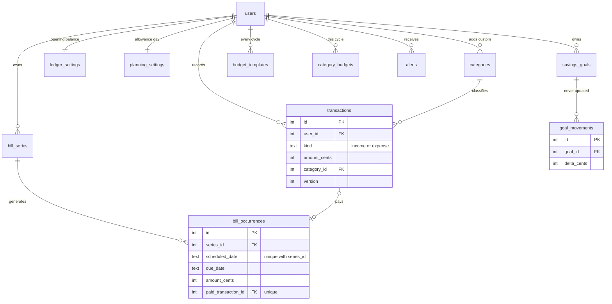
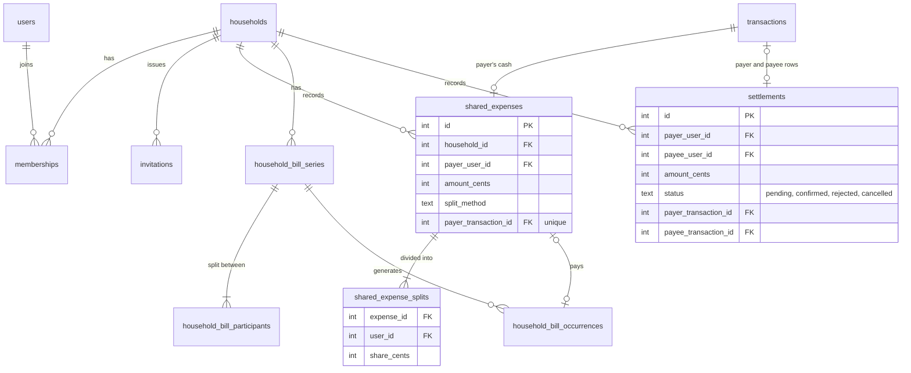

# Float: Project Report

**Individual Assignment 1: a simple application as the basis for DevOps work**

Sanad AlBilleh · 4 October 2026 · Repository: https://github.com/Sanad-AlBilleh/Float

## 1. The problem and the product

I live on a monthly allowance and share a flat, and I often can't answer a simple question: *how much can I safely spend today?* Not all the money in my account is mine to spend. Some of it is already needed for bills, some for my share of the rent, some for what I owe my flatmates, and some for savings. A banking app only shows my balance, and a splitting app like Splitwise only shows debts. Nothing puts the two together.

Float puts them together. I type in my income and expenses by hand (it never connects to a bank), and the dashboard shows:

> safe to spend per day = (my balance − bills due before my next allowance − my share of household bills − my savings − what I owe flatmates − planned goal savings) ÷ days until my next allowance

Every number on the dashboard links to the records behind it. Around it, Float has recurring bills, savings goals with a monthly plan, budgets, warnings for unusual expenses, a spending forecast, shared households with exact cost splitting and a settle-up plan, alerts, an activity feed and a JSON API.

My first idea (28 September) was a simple allowance tracker for one person. The professor said the idea and the backend were too simple, so on 30 September I made it bigger (version 0.2) with shared households, recurring bills, goal plans, a forecast, alerts and multiple users. The professor approved the new scope that day, before I wrote any code.

**Who it is for.** Students on a fixed allowance who share a flat with 2 to 8 people. Parents who send the allowance also benefit, because their child runs out of money less often. I assumed one flat runs Float on one computer at home, with up to about 16,000 transactions after a few years, and the speed test uses that number.

## 2. SDLC model and SMART goals

**The model: build a small, working, tested part every day.** Each day I built one complete piece of the app (database, logic, pages and tests together) and merged it into `main` with a pull request. Tests were written before the code.

**How I chose it.** On 30 September I asked Claude whether I should build the whole app at once and then commit it in pieces each day, or really build it day by day. It explained that committing finished work in pieces would give a false picture of when the work happened and leave early commits that don't run. So I chose to build each day's part on that day. Three more reasons made it the right choice for me:
- The professor's feedback had just changed my scope, so I needed a process that could handle changes. A waterfall plan, where everything is designed up front, would not have handled that well.
- I worked alone for one week, so full Scrum (sprints, stand-ups, a backlog board) would have been extra process with no benefit.
- Float is about money, and the SRS has worked examples with exact cent values. Turning each one into a test before writing the code was the easiest way to know the numbers were right.

The plan I wrote down in `planned-commits.md` on 30 September was:
- **28 Sep:** the idea and the first requirements.
- **30 Sep:** the new requirements and the base of the app (settings, database, money and date rules).
- **1 Oct:** accounts, security and my personal transactions.
- **2 Oct:** bills, goals, safe-to-spend, the forecast and budgets.
- **3 Oct:** households, settlements, alerts and the JSON API (the first thing to cut if I ran late).
- **4 Oct:** testing, fixes and design only.

**SMART goals** (from PRD section 10, all due by 4 October 2026):
- **G1:** A new user signs up, finishes setup and adds an expense in under 2 minutes. *Result:* automated page tests cover this journey. When I timed it myself, it took 80 seconds, so the goal is met.
- **G2:** Two flatmates add a shared expense, see the same balances and finish a confirmed settlement in under 3 minutes. *Result:* automated tests cover this journey. When I timed it myself, it took 152 seconds, so the goal is met.
- **G3:** Every part of the app keeps its data in SQLite after a restart. *Result:* met. Checked on the real server on 2, 3 and 4 October.
- **G4:** Every worked example in the SRS passes, splits always add up to the exact amount, household balances always add up to zero, and at least 70% of the business code is covered by tests. *Result:* met. Examples A to G pass, the random (Hypothesis) tests pass, and coverage is 97%.
- **G5:** No number on the dashboard counts the same money twice. *Result:* met. A random test checks this over long chains of actions.
- **G6:** No user can see or change another user's private records. *Result:* met. Tests check every page that shows records and every group of API routes.
- **G7:** Clone, install and one start command give a working app. *Result:* met. A fresh clone installed, started and passed every test on 4 October.

**What actually happened.** The plan mostly held, and I wrote every change in `planned-commits.md` on the day it happened:
- On 30 September I moved all the 4 October features to 2 and 3 October, so the last day could be for testing.
- The JSON API was first in line to be cut, but I had time on 3 October, so I built it.
- There were three extra fix commits I hadn't planned: on 1 October the request log never printed and a review found 11 small issues, and on 3 October the checkboxes looked stretched.
- On 4 October I did more than fixes. After using the app I asked for a new design based on screenshots I liked, custom categories, automatic categories, a savings question in setup and a demo data script. This broke my own "no new features on the last day" rule, and I wrote that down.
- I didn't push anything on 29 September, so every day after that needed real work to reach 6 days of commits.

In the end there are 63 commits over 6 days: 3 on 28 Sep, 9 on 30 Sep, 11 on 1 Oct, 8 on 2 Oct, 9 on 3 Oct and 23 on 4 Oct. The busiest day has 37% of them, under the 40% limit.

## 3. Architecture

Float is a **modular monolith**: one Python program running FastAPI, with HTML pages made from Jinja2 templates and an SQLite database, started with `python app.py` (ADR 1). It listens on `0.0.0.0`, reads `PORT` and `DATA_DIR` from environment variables, and creates its database by itself on the first start, so it already meets the deployment rules for Assignment 2.



**My two domains and where I would split them (ADR 2).** The two main domains are **my personal money** (Ledger and Planning: transactions, bills, goals and budgets) and **the shared flat** (Households: members, shared expenses, settlements and household bills). Identity (accounts) and Insights (calculations) are smaller extra parts. Each one is a folder with `rules.py` (pure calculations), `repository.py` (SQL for its own tables only), `service.py` and `api.py`. Other code can only use it through `api.py`, and `tests/test_architecture.py` fails if one domain imports another. The one exception is Insights, which may read the others through their `api.py`, because it only calculates. The pages and the API also take a few simple things straight from a domain's `api.py`, like types, form checks and the category list, but every change to money or membership goes through the application layer.

Some actions touch two domains. Paying a household bill creates a shared expense (Households) and the payer's expense (Ledger). Confirming a settlement writes into two people's transactions. That code lives in `app/application/`, and each action runs inside one SQLite transaction with an audit record, so it either fully happens or doesn't happen at all. This layer is where I would split the app later: if Households became its own service, these functions would become API calls between services.

**No background jobs (ADR 5).** Recurring bills are created when a page needs them, and doing it twice is harmless (`INSERT ... ON CONFLICT DO NOTHING`). Alerts are worked out again when the dashboard opens and after every change. This keeps Float to one process.

## 4. Database

All data is in one SQLite file at `DATA_DIR/float.sqlite3`, created by 12 numbered migration files (`app/db/migrations/0001` to `0012`). The main rules (ADR 3): money is always stored as whole cents; every table is `STRICT` and has `CHECK` rules; a bill is paid only when `paid_transaction_id` points at the expense that paid it, so there is no "paid" flag that can be wrong; each bill date is stored once per series; goal movements can't be changed and audit records can't be changed or deleted (triggers block it); and rows that people edit have a `version` number so two edits at once can't overwrite each other.

**My personal money (Identity, Ledger, Planning, Insights):**



**The shared flat (Households), linked to my transactions:**



Six small support tables are not drawn: `sessions` and `login_attempts` (logins), `audit_events` (the change history that can never be edited), `alert_cursors`, `idempotency_keys` (stops the API from saving the same request twice) and `schema_migrations`. All their columns are in the migration files.

**How the two domains' data connects.** Households never keep a separate copy of anyone's money. A shared expense points at the payer's real transaction through `payer_transaction_id`, and a confirmed settlement points at one transaction in each person's records. So the Ledger is the only record of cash, and Households only stores who owes whom.

## 5. Two calculations I'm proud of

**Splitting a cost exactly (`allocate` in `app/households/rules.py`).** First each person gets `amount × weight // total_weight`, which rounds down. Then the leftover cents are handed out one at a time to the people with the biggest remainders, and if there is a tie, the lower user ID gets it first. Worked by hand: €100.00 split equally between three people is 10,000 cents. Each person gets 10,000 × 1 // 3 = 3,333 cents, which hands out 9,999 cents and leaves 1. All three remainders are the same, so the person with the lowest user ID gets the extra cent: €33.34, €33.33 and €33.33, which adds up to exactly €100.00. A Hypothesis test checks that the shares always add up, using many random amounts and weights.

**The settle-up plan (`simplify`).** Each person's balance is what they paid minus their shares, and all the balances add up to zero. `simplify` keeps taking the person who is owed the most and the person who owes the most, and makes a payment of the smaller of the two amounts. Example: Borja +€40, Lucía −€10, Marco −€30. First Marco pays Borja €30 (now Marco is at 0 and Borja at +€10), then Lucía pays Borja €10. That is 2 payments for 3 people. It never needs more than one payment fewer than the number of people, but it is not always the smallest number possible.

**Safe-to-spend never counts money twice.** When I pay a bill, the money moves from "set aside for bills" to "spent", so the daily number stays the same. A random test runs long chains of bill payments, household bill payments, settlements and savings and checks this every time.

## 6. Testing

My testing approach is ADR 4. In short: every calculation is a pure function tested against the worked examples in the SRS; Hypothesis tries many random inputs for the rules that must always hold; database code is tested on a real temporary SQLite file instead of a fake one (including a test that makes a step fail halfway, and a test where two connections confirm the same settlement at once); page and API tests check who can see what and that forged forms are refused; and after each feature, small planted bugs check that the tests notice.

**Coverage command** (also in the README):

```
pytest --cov=app.identity --cov=app.ledger --cov=app.planning --cov=app.households --cov=app.insights --cov=app.application --cov=app.shared --cov-report=term-missing
```

**Results on 4 October:**
- 604 tests passed.
- 97% of the business code is covered (2,925 lines, 83 missed), and 95% of the whole app.
- On 2 and 3 October I planted 121 small bugs. 38 got past the tests the first time: 29 were real gaps that got new tests, and 9 could not change how the app behaves.
- With 16,000 transactions, the dashboard answered in 48 ms (p95) against a 500 ms limit, and the app was ready 62 ms after starting.
- Three reviews by a helper agent found 11 issues (1 October), 9 issues (3 October) and 5 more on the evening of 4 October. The worst on 4 October was a paid household bill showing Edit and Delete links that led to an error page. All 25 were fixed with the tests written first.

The planted bugs taught me the most. Even with almost every line covered, they found cases the tests missed, like a bill due exactly on payday, which only showed up when changing a `<` to `<=` didn't make any test fail.

## 7. Setup and the demo account

The README explains how to run Float: create a virtual environment, `pip install -r requirements.txt`, then `python app.py`, and open http://localhost:8000. It also lists the environment variables and where the database is saved. To see Float with a month of data already in it, the README shows one extra command that creates the demo account (Borja, username `Borjita_Best_Prof`) and two flatmates before the first start.

## 8. Reflection

Building a working piece every day meant `main` always had a version that ran. That helped when the professor asked for a bigger scope, because I could change the plan without throwing away working code. The hardest part was the shared money rules: making sure a household bill, a settlement and a personal bill each move money between "set aside", "owed" and "spent" without changing safe-to-spend took longer than any page. The new design was also harder than it looked, because our security settings block inline styles, so every progress bar had to be drawn as an SVG.

If I did this again, I would push something on 29 September so I had a spare day, plan the design earlier instead of leaving it to the end, and keep the last day for fixes only, as I first planned.

**What I checked myself.** I used the running app and gave my own design feedback on 4 October (card padding, the setup layout, the form fields, the budget boxes and custom categories). I also had the review agents test the real running app instead of only trusting the tests. One thing to fix before a real deployment: login limits count failed logins per address, and behind a cloud proxy every user might share one address, so I would read the real address from the proxy's header.

## 9. AI disclosure

I acknowledge the use of OpenAI Codex and Anthropic's Claude Code (Claude Opus 5.5) to choose and shape the idea, write the requirements, plan the build, write the code and tests, review the app for bugs, redesign the interface, and draft the documentation, including this report. The prompts used include "give me 5 ideas i could do", "the professor said the idea is a bit weak and needs to be a bit more complex", "start executing the 30 sep build and commit push and merge it", "run a opus 5.5 medium effort helper to review the entire app" and "look at the screenshots, i want the app to look something similar to this UI". The output of these prompts was used to produce the PRD, SRS and build plan, the Float code and its tests, the bug fixes, the ADR and README drafts, and this report. I made the decisions and reviewed the work at each step. The full log, prompt by prompt, with my own explanation of how each part works, is in `AI_USAGE.md`.

## 10. Conclusion

Float meets its goals: both domains save everything in SQLite, the money is exact to the cent, the tests cover 97% of the business code, and a fresh clone runs with one command. I'm proudest of the safe-to-spend number, because it combines my own money and the flat's money without ever counting the same euro twice. Next I would add importing bank statements as CSV and "this and future" edits for household bills, and in Assignment 2 I would split Households into its own service, using the application layer as the place to cut.
