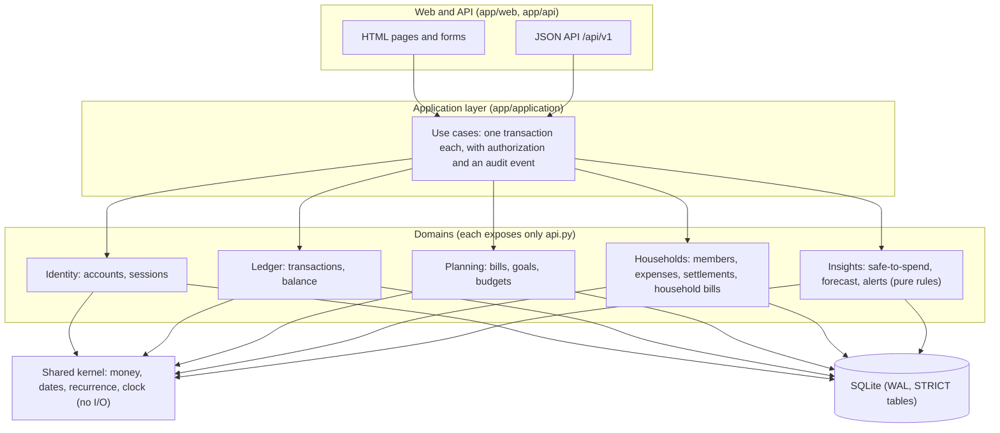
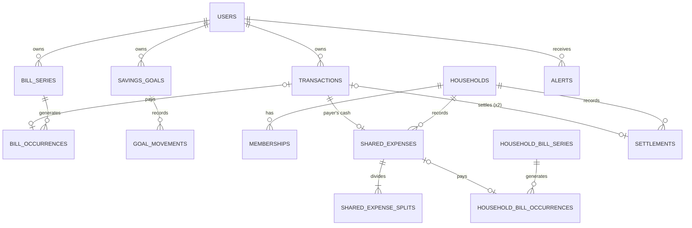

# Float: project report (draft)

**Status:** draft written on 3 October 2026; measured numbers refreshed on 4 October from `docs/acceptance-2026-10-04.md`. Sections marked **[Student to write]** must be written by the student in their own words. They cannot be drafted by an AI tool without misrepresenting who did the thinking.

## 1. The problem and the product

Students on a fixed monthly allowance who share a flat struggle to answer a simple question: *how much can I safely spend today?* Their cash is not all theirs to spend. Some is committed to recurring bills, some to their share of the flat's costs, some to what they already owe flatmates, and some to savings goals. Banking apps show a balance; splitting apps show debts; neither combines them.

Float is a web app that combines them. A user records income and expenses by hand (Float never connects to a bank). Float then shows a **safe-to-spend amount per day** until the next allowance:

> recorded balance − bills due before the next allowance − their share of household bills − protected savings − what they owe flatmates − planned goal contributions

Every term links to the records behind it. Around that number, Float offers:
- recurring bills;
- savings goals with per-cycle contribution plans;
- budgets and unusual-expense flags;
- a pace-based forecast;
- households with exact cost splitting, a settle-up plan, and two-party settlements;
- in-app alerts and activity feeds;
- a JSON API.

Version 0.1 of the requirements (28 September) was a single-user allowance tracker. After the professor's feedback that the idea and backend were too simple, version 0.2 (30 September) added households, recurrence, goal plans, forecasting, alerts, and multi-user security. The student reported the professor's approval of v0.2 on 30 September, before any application code was written.

## 2. Goals (SMART)

The PRD (§10) set these goals for the 4 October 2026 deadline. The results column comes from measurements.

| # | Goal (specific, measurable, time-bound) | Result so far |
|---|---|---|
| G1 | A new user registers, completes setup, and records an expense in under two minutes | Manual timing in the student's walkthrough (to be recorded) |
| G2 | Two flatmates record a shared expense, see matching balances, and complete a confirmed settlement in under three minutes | Automated end to end; manual timing in the student's walkthrough (to be recorded) |
| G3 | Every domain persists in SQLite across restarts | Real-server smoke tests on 2 and 3 October; the demo database survived repeated restarts on 4 October |
| G4 | Every SRS fixture passes; splits always sum exactly; household nets always sum to zero; ≥ 70% coverage of business modules | Fixtures A–G pass; Hypothesis properties pass; **97%** coverage of the business modules |
| G5 | No dashboard number double-counts money | Conservation steps 1–4 of Fixture A and a randomized conservation property pass |
| G6 | No user can read or change another user's private records | Authorization matrices for pages and API pass |
| G7 | Clone, install, and one start command give a ready app | Fresh-clone check passed on 4 October |
| G8 | README, five ADRs, AI log, diagrams, and this report are accurate | Five ADRs written on 1, 2, and 3 October; this draft |

These goals are achievable because the scope was ordered strictly by priority (P0, then P1, then P2) and each day delivered a tested, merged slice.

## 3. Planned SDLC compared with what happened

**Plan.** The team (one student, assisted by AI tools; see §8) chose an incremental, test-first process with one vertical slice per day. `planned-commits.md` fixed the schedule on 30 September, and `EXECUTION_PLAN.md` broke each day into tasks with interfaces, SQL, and tests:

| Day | Planned slice |
|---|---|
| 30 Sep | Requirements v0.2 and the foundation |
| 1 Oct | Accounts and the personal ledger |
| 2 Oct | Bills, goals, safe-to-spend, and the forecast |
| 3 Oct | Households, alerts, the JSON API (if time allowed), and this draft |
| 4 Oct | Testing, fixes, and polish only; no new features |

Each day ended with a pull request merged into `main`.

**What happened.** The plan held. The differences, all recorded the same day in `planned-commits.md`:
- **The schedule changed once on request.** On 30 September the student moved all 4 October feature work to 2 and 3 October, keeping the last day for testing.
- **Three unplanned commits:**
  - on 1 October, the real-server smoke test found that the request log never reached the server output;
  - on 1 October, a helper-agent review found 11 smaller issues, fixed with 36 tests;
  - on 3 October, a browser check found stretched checkboxes.
- **4 October went beyond fixes, at the student's request:**
  - a full interface redesign from reference screenshots;
  - custom categories, automatic categorization, and savings in setup;
  - a demo-data seeder.

  These were requested on the day and are recorded in `planned-commits.md`.
- **One planned cut was not needed.** The JSON API was the first item to cut if a day ran late. It was built on 3 October because time remained.
- **Not built:**
  - the P2 stretch features (CSV import, category suggestions, cycle review);
  - "this and future" edits of household bills.

  Both are listed in the README.

**Commits by day** (from `git log`, merges included):

| 28 Sep | 30 Sep | 1 Oct | 2 Oct | 3 Oct | 4 Oct |
|---|---|---|---|---|---|
| 3 | 9 | 11 | 8 | 9 | 16 |

The assignment's rules (at least 12 commits on at least 6 days, no day above 40%) hold once 4 October adds its commits: the largest day (4 October, 16 of 56) is 29% of the total. Nothing was pushed on 29 September, so every later day had to carry real work.

**[Student to write]:** a paragraph on how working in daily slices felt in practice, what was harder than planned, and what you would plan differently.

## 4. Architecture

Float is a **modular monolith**: one Python process (FastAPI, Jinja2 server-rendered pages, and SQLite), started with `python app.py` (ADR-1). The code is split into domains that never import each other; an application layer coordinates them (ADR-2):

**Why this shape:**
- **Cross-domain workflows are single transactions.** Paying a bill, paying a household bill, and confirming a settlement each touch two or three domains. They run as one SQLite `BEGIN IMMEDIATE` transaction, so they either happen completely or not at all, without distributed-transaction machinery.
- **The boundaries are enforced.** An architecture test reads every import and fails if a domain imports another.
- **No background jobs (ADR-5).** Bills are generated lazily and idempotently when a page needs them, and alerts are evaluated when the dashboard loads and after every change.

**Schema (ADR-3).** Key rules:
- all money is integer cents in `STRICT` tables with `CHECK` constraints;
- an occurrence is paid exactly when a link column points at the expense that paid it;
- goal movements and audit events are append-only.

The main relationships:

The full schema is in `app/db/migrations/0001`–`0011` and SRS §7.

## 5. The interesting algorithms

- **Exact money.** Input like `1 234,56` is parsed with integer arithmetic. Anything ambiguous, such as `12 50`, is refused rather than guessed. Floats never touch money.
- **Recurrence.** Monthly rules keep the anchor day (31 Jan → 28 Feb → 31 Mar) without drifting. Each occurrence keeps the date its rule generated as a uniqueness key, separate from its editable due date, so materializing twice can never duplicate a bill.
- **Exact splits.** `allocate` gives each person `amount × weight // total` and hands the leftover cents to the largest remainders, ties going to the lower user ID. For example, €100 split three ways gives €33.34, €33.33, and €33.33.
- **Settling up.** `simplify` repeatedly matches the person owed the most with the person who owes the most, giving at most n − 1 transfers.
- **Safe-to-spend and conservation.** Converting a reservation into a payment never changes what someone may spend, unless what they are owed changes. Paying a bill moves money from "reserved" to "spent". Paying a household bill moves the flatmates' shares from "reserved" to "owed". This identity is tested over random sequences of actions.
- **Forecast.** Pace is everyday spending over up to 28 days. From it come the runway, the run-out date, a day-by-day projection with and without the expected allowance, and an estimate for the next cycle.

**[Student to write]:** explain one of these algorithms in your own words, with an example you work through by hand.

## 6. Testing and quality

The testing strategy is ADR-4: pure-rule unit tests for every SRS fixture, Hypothesis property tests for the invariants, integration tests on real temporary SQLite databases (with fault injection and race tests), HTTP tests for the pages and the API, and daily mutation spot-checks.

Results (4 October):

| Measure | Result |
|---|---|
| Automated tests | 598 passing |
| Coverage of business modules | 97% (2,910 statements, 83 missed) |
| Coverage of all modules | 95% (4,794 statements, 245 missed) |
| Mutation checks on 2 and 3 October | 121 injected bugs. 38 survived the first run: 29 gaps closed with new tests, and 9 recorded as equivalent |
| Real-server smoke tests | 13 steps (2 October) and 23 steps with two users (3 October), all passing |
| Dashboard performance (NFR-05) | p95 48 ms on the SRS synthetic dataset (limit 500 ms); ready in 62 ms |
| Review findings (3 October) | 9 found, 9 fixed test-first on 4 October |

Coverage is a floor, not the goal. The mutation checks were more useful: they found boundary bugs that full line coverage had hidden, such as a bill due exactly on payday and a runway equal to the days left.

## 7. Risks and unfinished items

| Item | Status and mitigation |
|---|---|
| P2 features (CSV import, category suggestions, cycle review) | Not implemented, by plan |
| "This and future" edits of household bills | Not implemented. Workaround: edit or skip an occurrence, or end the series and create a new one |
| Idempotent API response stored after the change commits, not in the same transaction | A crash in between refuses a retry for 24 hours instead of duplicating money (documented in code and the README) |
| SQLite allows one writer at a time | Enough for a flat on one machine; measured by the NFR-05 smoke test |
| Alerts appear only when someone opens Float | A deliberate trade-off (ADR-5) |
| Manual records may be incomplete | Every figure is labelled "recorded", and the allowance reminder appears until the allowance is recorded |
| AI-written code must be understood | The student explains each part in the AI log and prepares for the written check |

## 8. AI disclosure

AI tools were used throughout, with the student's knowledge and the course's permission:
- **OpenAI Codex** helped choose the idea and drafted the v0.1 requirements (28 September).
- **Anthropic's Claude Code** revised the requirements to v0.2 and wrote the execution plan, the code, the tests, the ADR drafts, and this draft. It also ran the tests, the mutation checks, and the real-server smoke tests, and committed, pushed, and merged each day's work at the student's request.
- **A helper Claude agent** reviewed Days 0–1 and found 11 issues, which were then fixed.

Every meaningful interaction is logged in `AI_USAGE.md`, with the prompt, what was accepted or changed, and why. Its last column is reserved for the student's own explanation of how the code works. Every row there currently says "AI-authored draft; student explanation pending", and the student must replace that text.

**[Student to write]:** the course's prescribed AI disclosure statement, and a short reflection on what you checked yourself, what you changed, and what you learned from reviewing AI-written code.

## 9. Conclusion

**[Student to write]:** what Float achieves against the goals in §2, what you are proudest of, and what you would build next.
